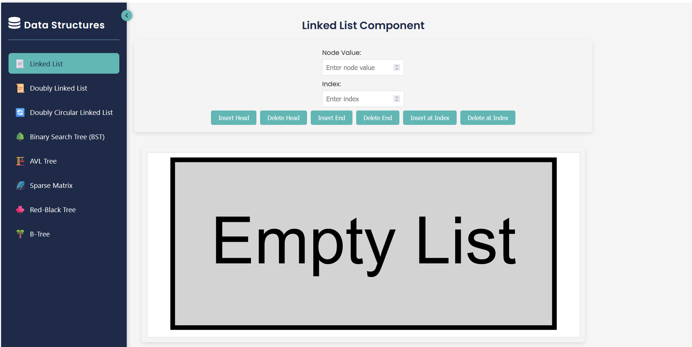
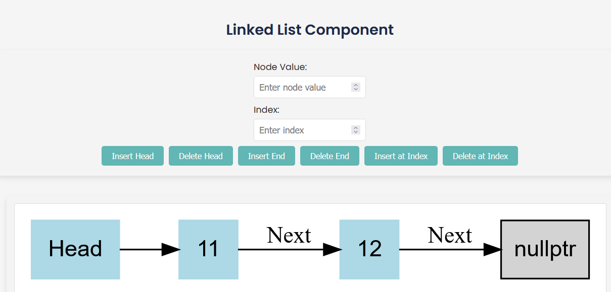
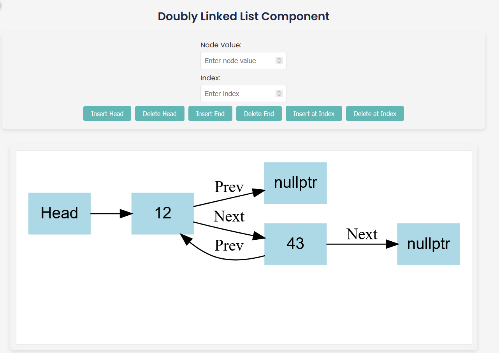
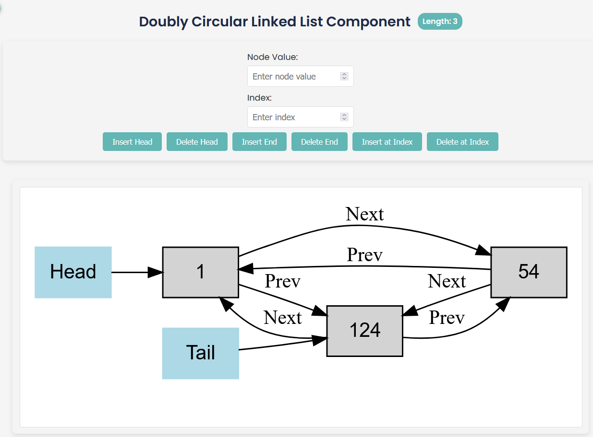
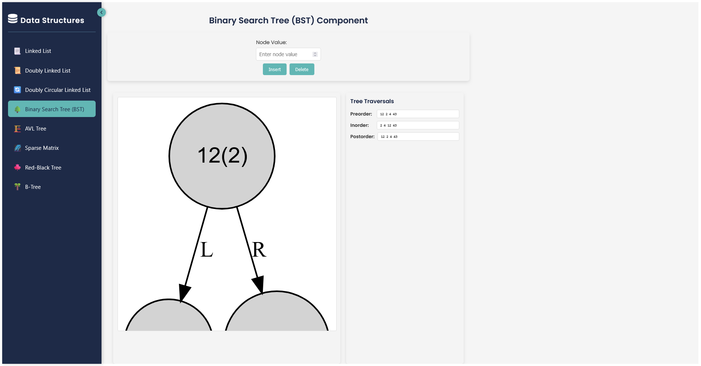
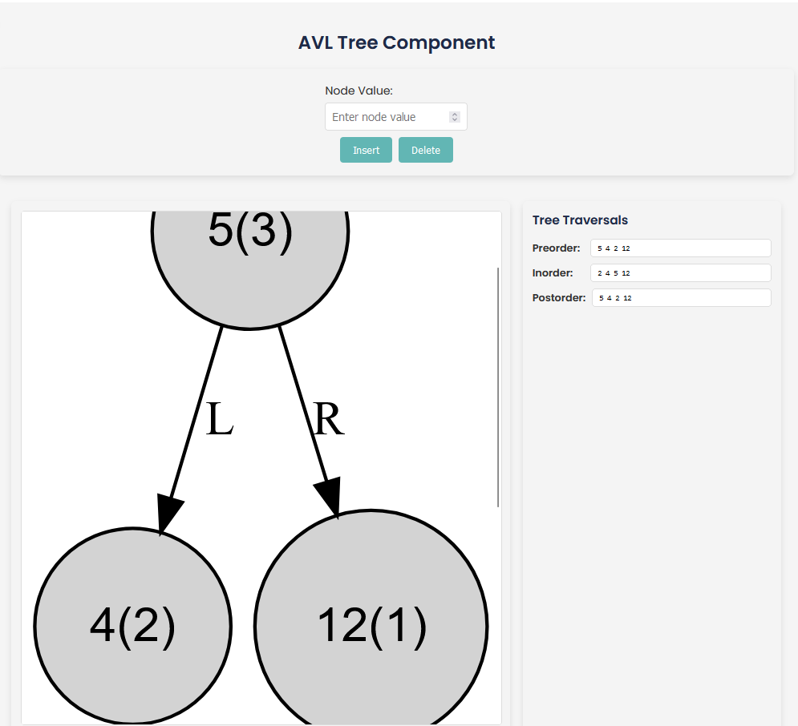
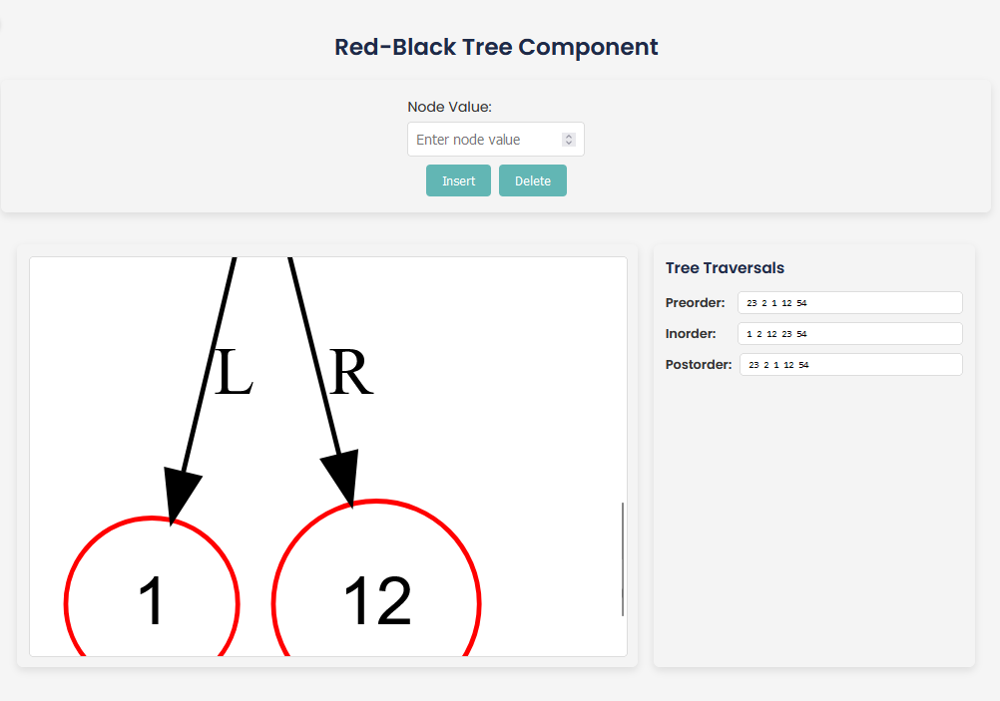
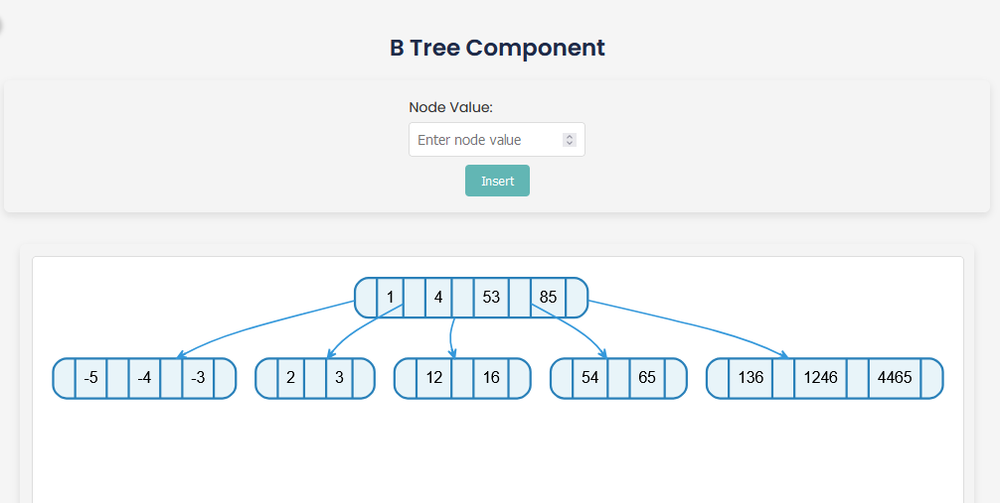

# Data Structures

[](https://opensource.org/licenses/MIT)

This is a personal project where I implement some data structures in c++, and used Graphviz to visualize them in a frontend using Vis.js in React.

## Table of Contents

- [Linked List](docs/linkedList/README.md) | [Lista enlazada](docs/linkedList/ES/README.md)




- [Doubly Linked List](docs/doublyLinkedList/README.md) | [Lista doblemente enlazada](docs/doublyLinkedList/ES/README.md)



- [Doubly Circular Linked List](docs/doublyCircularList/README.md) | [Lista doblemente enlazada circular](docs/doublyCircularList/ES/README.md)



- [Binary Search Tree](docs/binarySearchTree/README.md) | [Árbol binario de búsqueda](docs/binarySearchTree/ES/README.md)



- [AVL Tree](docs/avlTree/README.md) | [Árbol AVL](docs/avlTree/ES/README.md)



- [Red Black Tree](docs/redBlackTree/README.md) | [Árbol Rojo-Negro](docs/redBlackTree/ES/README.md)



- [B Tree](docs/BTree/README.md) | [Arbol B](docs/BTree/ES/README.md)



## How to use this project

Before you begin, ensure you have the following installed:

- **C++ Compiler**: Ensure you have a C++ compiler installed (e.g., `g++`).
- **Graphviz**: Required for generating visualizations. Install it from [here](https://graphviz.org/download/).
- **Node.js and npm**: Required for running the React frontend. Download and install from [here](https://nodejs.org/).

### Instalation

1. **Clone the repository**:

    ```bash
    git clone https://github.com/HenryD11703/estructuras-de-datos.git
    cd estructuras-de-datos
    ```

2. **Install dependencies**:

    ```bash
    cd frontend
    npm install
    ```

### Running the project

1. **Compile the C++ code**:

    ```bash
    # on root
    make

    # and run the binary

    ./bin/program 
    ```

2. **Start the React Frontend**:

    ```bash
    cd backend
    npm run dev
    ```

3. Open your browser and navigate to `http://localhost:5173/` to see the project running.

## License

This project is open source and available under the [MIT License](LICENSE).

## Contributing

If you would like to contribute to this project, please open an issue or a pull request. I am always open to new ideas and suggestions.

You can also open an issue if you find a bug or have a question.

### Make file

```makefile
# Definir compilador y flags
CXX = g++
CXXFLAGS = -std=c++17 -Iinclude -g  
LDFLAGS = -pthread

# Directorios
SRC_DIR = src
OBJ_DIR = build
BIN_DIR = bin
LIB_DIR = lib
DOC_DIR = docs

# Archivos fuente
SOURCES = $(wildcard $(SRC_DIR)/*.cpp)
OBJECTS = $(SOURCES:$(SRC_DIR)/%.cpp=$(OBJ_DIR)/%.o)
EXECUTABLE = $(BIN_DIR)/program

# Reglas
all: directories $(EXECUTABLE)

$(EXECUTABLE): $(OBJECTS)
 $(CXX) $(OBJECTS) -o $(EXECUTABLE) $(LDFLAGS)

$(OBJ_DIR)/%.o: $(SRC_DIR)/%.cpp
 $(CXX) $(CXXFLAGS) -c $< -o $@

# Crear los directorios necesarios
directories: $(OBJ_DIR) $(BIN_DIR)

$(OBJ_DIR):
 mkdir -p $(OBJ_DIR)

$(BIN_DIR):
 mkdir -p $(BIN_DIR)

# Limpiar los archivos generados
clean:
 rm -rf $(OBJ_DIR)/*.o $(EXECUTABLE)

.PHONY: all clean directories
```

this makefile uses the following structure:

```plaintext
.
├── build.sh
├── CMakeLists.txt
├── docs
│   ├── avlTree
│   │   ├── ES
│   │   │   └── README.md
│   │   ├── LLImbalance.png
│   │   ├── LLRotation.png
│   │   ├── LRImbalance.png
│   │   ├── LRRotation.png
│   │   ├── README.md
│   │   ├── RLImbalance.png
│   │   ├── RLRotation.png
│   │   ├── RLRotationWithChild.png
│   │   ├── RRImbalance.png
│   │   ├── RRRotation.png
│   │   └── RRRotationWithChild.png
│   ├── binarySearchTree
│   │   ├── ES
│   │   │   └── README.md
│   │   ├── insert.png
│   │   └── README.md
│   ├── BTree
│   │   ├── ES
│   │   │   └── README.md
│   │   └── README.md
│   ├── doublyCircularList
│   │   ├── deleteAtHead.png
│   │   ├── deleteAtIndex.png
│   │   ├── deleteAtTail.png
│   │   ├── ES
│   │   │   └── README.md
│   │   ├── insertAtHead.png
│   │   ├── insertAtIndex.png
│   │   ├── insertAtTail.png
│   │   └── README.md
│   ├── doublyLinkedList
│   │   ├── DeleteAtEnd.png
│   │   ├── DeleteAtHead.png
│   │   ├── DeleteAtPosition.png
│   │   ├── ES
│   │   │   └── README.md
│   │   ├── InsertAtEnd.png
│   │   ├── InsertAtHead.png
│   │   ├── InsertAtPosition.png
│   │   └── README.md
│   ├── imgs
│   │   ├── avl.png
│   │   ├── bst.png
│   │   ├── btree.png
│   │   ├── dll1.png
│   │   ├── dll2.png
│   │   ├── llist2.png
│   │   ├── llist.png
│   │   ├── rbt.png
│   │   └── sparse.png
│   ├── linkedList
│   │   ├── DeleteAtEnd.png
│   │   ├── DeleteAtHead.png
│   │   ├── ES
│   │   │   └── README.md
│   │   ├── InsertAtEnd.png
│   │   ├── InsertAtHead.png
│   │   ├── InsertAtIndex.png
│   │   └── README.md
│   ├── redBlackTree
│   │   ├── ES
│   │   │   └── README.md
│   │   └── README.md
│   └── sparceMatrix
│       ├── ES
│       │   └── README.md
│       ├── image.png
│       ├── pokeball.json
│       └── README.md
├── include
│   ├── avlTree.h
│   ├── binarySearchTree.h
│   ├── BTree.h
│   ├── doublyCircularList.h
│   ├── doublyLinkedList.h
│   ├── linkedList.h
│   ├── redBlackTree.h
│   └── sparceMatrix.h
├── lib
│   ├── httplib.h
│   └── json.hpp
├── LICENCE
├── Makefile
├── README.md
├── scripts
│   └── generate_graphs.sh
├── src
│   ├── AVLTree.cpp
│   ├── binarySearchTree.cpp
│   ├── BTree.cpp
│   ├── doublyCircularList.cpp
│   ├── doublyLinkedList.cpp
│   ├── linkedList.cpp
│   ├── main.cpp
│   ├── redBlackTree.cpp
│   ├── server
│   │   ├── AVLTreeEndpoints.cpp
│   │   ├── binarySearchTreeEndpoints.cpp
│   │   ├── BTreeEndpoints.cpp
│   │   ├── doublyCircularListEndpoints.cpp
│   │   ├── doublyLinkedListEndpoints.cpp
│   │   ├── linkedListEndpoints.cpp
│   │   ├── redBlackTreeEndpoints.cpp
│   │   └── sparseMatrixEndpoints.cpp
│   └── sparseMatrix.cpp
└── utils
    └── graphviz
        ├── avlTree.dot
        ├── avlTree.png
        ├── binarySearchTree.dot
        ├── binarySearchTree.png
        ├── doublyCircularList.dot
        ├── doublyCircularList.png
        ├── doublyLinkedList.dot
        ├── doublyLinkedList.png
        ├── linkedList.dot
        ├── linkedList.png
        └── sparseMatrix.dot
```

If you want to add more data structures, you can follow the same structure as the existing ones. The makefile will compile the new files and generate the necessary objects.

The header files are in the `include` directory, and the source files are in the `src` directory. The makefile will compile the source files and generate the objects in the `build` directory.

The `docs` directory contains the documentation for each data structure. The documentation is written in markdown and includes images of the data structure.
