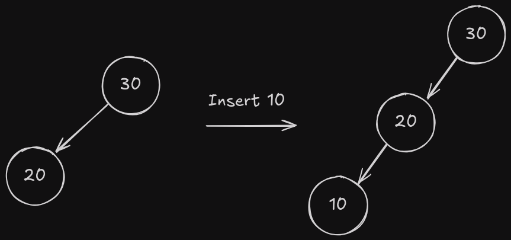
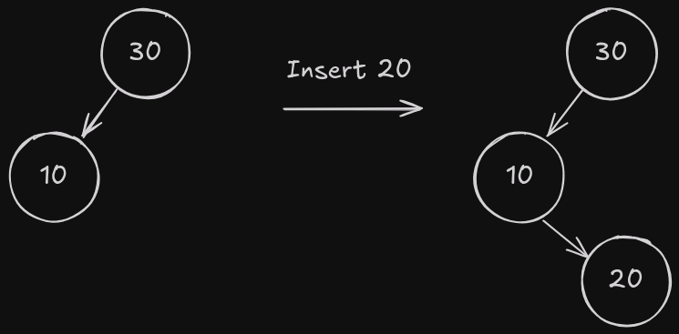
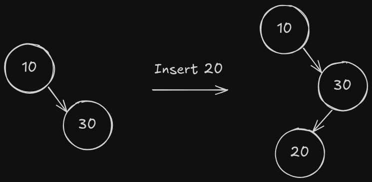

# Árbol AVL

Primero, te recomiendo leer el artículo sobre [Árbol Binario de Búsqueda](../binarySearchTree/README.md).

En segundo lugar, te recomiendo ver este increíble video de Abdul Bari explicando la teoría de los Árboles AVL y cómo funcionan el balanceo y las operaciones.

[](https://www.youtube.com/watch?v=jDM6_TnYIqE)

Un árbol AVL es un árbol binario de búsqueda (BST) auto-balanceado donde la diferencia entre las alturas de los subárboles izquierdo y derecho para cualquier nodo no puede ser mayor que uno. Esta condición de balance asegura que la complejidad temporal de las operaciones se mantiene en O(log n).

## ¿Por qué Árboles AVL?

Los BST regulares pueden desequilibrarse, llevando a una complejidad temporal en el peor caso de O(n) para operaciones como búsqueda, inserción y eliminación. Los árboles AVL son auto-balanceados y mantienen una complejidad temporal de O(log n) para estas operaciones, porque aseguran que la altura del árbol se mantiene en O(log n).

## Un poco de teoría

Los árboles AVL reciben su nombre de sus inventores Adelson-Velsky y Landis. Un árbol AVL es un árbol binario de búsqueda donde cada nodo tiene un factor de balance, que es la diferencia entre la altura del subárbol izquierdo y la altura del subárbol derecho. El factor de balance de cualquier nodo es -1, 0 o 1. Si el factor de balance de cualquier nodo no es -1, 0 o 1, el árbol está desequilibrado y se requieren rotaciones para balancearlo.

¿Cómo saber qué tipo de rotación hacer? Depende del factor de balance del nodo y sus hijos. Hay cuatro casos posibles:

1. Caso Izquierda-Izquierda (II): Un nodo tiene un factor de balance de 2 y su hijo izquierdo tiene un factor de balance de 1 o 0.
2. Caso Derecha-Derecha (DD): Un nodo tiene un factor de balance de -2 y su hijo derecho tiene un factor de balance de -1 o 0.
3. Caso Izquierda-Derecha (ID): Un nodo tiene un factor de balance de 2 y su hijo izquierdo tiene un factor de balance de -1.
4. Caso Derecha-Izquierda (DI): Un nodo tiene un factor de balance de -2 y su hijo derecho tiene un factor de balance de 1.

### Rotación II

En la rotación II, el hijo izquierdo del nodo desequilibrado se convierte en la nueva raíz del subárbol, y el nodo desequilibrado se convierte en el hijo derecho de la nueva raíz.

Esta imagen muestra cuándo hacer una rotación II:



Y esta imagen muestra el resultado de la rotación II:


Como puedes ver, tomamos el nodo desequilibrado y lo hacemos el hijo derecho del hijo izquierdo.

### Rotación DD

En la rotación DD, el hijo derecho del nodo desequilibrado se convierte en la nueva raíz del subárbol, y el nodo desequilibrado se convierte en el hijo izquierdo de la nueva raíz.

Esta imagen muestra cuándo hacer una rotación DD:


Y esta imagen muestra el resultado de la rotación DD:


Como puedes ver, tomamos el nodo desequilibrado y lo hacemos el hijo izquierdo del hijo derecho.

#### Consideraciones para Rotaciones II y DD

En estos dos casos hay una consideración especial a tener en cuenta cuando el nodo que se convierte en la nueva raíz tiene un hijo derecho (o izquierdo), en este caso necesitamos hacer que el hijo derecho (o izquierdo) de la nueva raíz sea el hijo izquierdo (o derecho) de la antigua raíz.


### Rotación ID

En la rotación ID, primero hacemos una rotación DD en el hijo izquierdo del nodo desequilibrado, y luego hacemos una rotación II en el nodo desequilibrado.

Esta imagen muestra cuándo hacer una rotación ID:



Y esta imagen muestra el resultado de la rotación ID:


### Rotación DI

En la rotación DI, primero hacemos una rotación II en el hijo derecho del nodo desequilibrado, y luego hacemos una rotación DD en el nodo desequilibrado.

Esta imagen muestra cuándo hacer una rotación DI:



Y esta imagen muestra el resultado de la rotación DI:


#### Consideraciones para Rotaciones ID y DI

En estos dos casos hay una consideración especial a tener en cuenta cuando el nodo que se convierte en la nueva raíz tiene un hijo derecho (o izquierdo), en este caso necesitamos hacer que el hijo derecho (o izquierdo) de la nueva raíz sea el hijo izquierdo (o derecho) de la antigua raíz.


## Rotaciones en código

### Rotación II en C++

```cpp
avlTree::Nodo* avlTree::llRotation(Nodo* nodo) {
  Nodo* newRoot = nodo->left;
  Nodo* rootRight = newRoot->right;

  newRoot->right = nodo;
  nodo->left = rootRight;

  nodo->height = max(getHeight(nodo->left), getHeight(nodo->right)) + 1;
  newRoot->height =
      max(getHeight(newRoot->left), getHeight(newRoot->right)) + 1;

  return newRoot;
}
```

Esta función realiza una rotación izquierda-izquierda en el nodo dado. Toma el hijo izquierdo del nodo como la nueva raíz, luego toma el hijo derecho de la nueva raíz y lo hace el hijo izquierdo de la antigua raíz. Finalmente, actualiza la altura de la antigua raíz y la nueva raíz.

### Rotación DD en C++

```cpp
avlTree::Nodo* avlTree::rrRotation(Nodo* nodo) {
  Nodo* newRoot = nodo->right;
  Nodo* rootLeft = newRoot->left;

  newRoot->left = nodo;
  nodo->right = rootLeft;

  newRoot->height =
      max(getHeight(newRoot->left), getHeight(newRoot->right)) + 1;
  nodo->height = max(getHeight(nodo->left), getHeight(nodo->right)) + 1;

  return newRoot;
}
```

Esta función realiza una rotación derecha-derecha en el nodo dado. Toma el hijo derecho del nodo como la nueva raíz, luego toma el hijo izquierdo de la nueva raíz y lo hace el hijo derecho de la antigua raíz. Finalmente, actualiza la altura de la antigua raíz y la nueva raíz.

### Rotación ID en C++

```cpp
avlTree::Nodo* avlTree::lrRotation(Nodo* nodo) {
  nodo->left = rrRotation(nodo->left);
  return llRotation(nodo);
}
```

Esta función realiza una rotación izquierda-derecha en el nodo dado. Primero hace una rotación derecha-derecha en el hijo izquierdo del nodo, luego hace una rotación izquierda-izquierda en el nodo.

### Rotación DI en C++

```cpp
avlTree::Nodo* avlTree::rlRotation(Nodo* nodo) {
  nodo->right = llRotation(nodo->right);
  return rrRotation(nodo);
}
```

Esta función realiza una rotación derecha-izquierda en el nodo dado. Primero hace una rotación izquierda-izquierda en el hijo derecho del nodo, luego hace una rotación derecha-derecha en el nodo.

También usamos una función auxiliar para obtener la altura de un nodo:

```cpp
int avlTree::getHeight(Nodo* nodo) {
  int leftH, rightH;
  if (nodo == nullptr) {
    return 0;
  }
  leftH = getHeight(nodo->left);
  rightH = getHeight(nodo->right);
  return max(leftH, rightH) + 1;
}
```

Esta función devuelve la altura del nodo dado. Si el nodo es nulo, devuelve 0. De lo contrario, calcula la altura de los subárboles izquierdo y derecho y devuelve la altura máxima más 1.

## Operaciones en Árboles AVL

### Insertar

```cpp
void avlTree::insert(int val) { root = insert(root, val); }
avlTree::Nodo* avlTree::insert(Nodo* nodo, int val) {
  int leftHeight, rightHeight, balanceFactor;
  if (nodo == nullptr) {
    return new Nodo(val);
  }
  if (val < nodo->value)
    nodo->left = insert(nodo->left, val);
  else
    nodo->right = insert(nodo->right, val);

  nodo->height = 1 + max(getHeight(nodo->left), getHeight(nodo->right));

  leftHeight = getHeight(nodo->left);
  rightHeight = getHeight(nodo->right);
  balanceFactor = leftHeight - rightHeight;

  if (balanceFactor < -1 && val > nodo->right->value) return rrRotation(nodo);
  if (balanceFactor > 1 && val < nodo->left->value) return llRotation(nodo);

  if (balanceFactor > 1 && val > nodo->left->value) return lrRotation(nodo);
  if (balanceFactor < -1 && val < nodo->right->value) return rlRotation(nodo);

  return nodo;
}
```

Esta función inserta un nuevo nodo con el valor dado en el árbol AVL. Primero inserta el nodo recursivamente en el subárbol izquierdo o derecho dependiendo del valor del nodo. Luego actualiza la altura del nodo y calcula el factor de balance. Si el factor de balance es menor que -1 y el valor es mayor que el hijo derecho, hace una rotación derecha-derecha. Si el factor de balance es mayor que 1 y el valor es menor que el hijo izquierdo, hace una rotación izquierda-izquierda. Si el factor de balance es mayor que 1 y el valor es mayor que el hijo izquierdo, hace una rotación izquierda-derecha. Si el factor de balance es menor que -1 y el valor es menor que el hijo derecho, hace una rotación derecha-izquierda.

Paso a paso:

```cpp
  if (nodo == nullptr) {
    return new Nodo(val);
  }
```

Si el nodo es nulo, creamos un nuevo nodo con el valor dado.

```cpp
  if (val < nodo->value)
    nodo->left = insert(nodo->left, val);
  else
    nodo->right = insert(nodo->right, val);
```

Si el valor es menor que el nodo actual, lo insertamos en el subárbol izquierdo, de lo contrario lo insertamos en el subárbol derecho.

```cpp
  nodo->height = 1 + max(getHeight(nodo->left), getHeight(nodo->right));
```

Actualizamos la altura del nodo actual.

```cpp
  leftHeight = getHeight(nodo->left);
  rightHeight = getHeight(nodo->right);
  balanceFactor = leftHeight - rightHeight;
```

Calculamos la altura de los subárboles izquierdo y derecho y el factor de balance.

```cpp
  if (balanceFactor < -1 && val > nodo->right->value) return rrRotation(nodo);
  if (balanceFactor > 1 && val < nodo->left->value) return llRotation(nodo);

  if (balanceFactor > 1 && val > nodo->left->value) return lrRotation(nodo);
  if (balanceFactor < -1 && val < nodo->right->value) return rlRotation(nodo);
```

Si el factor de balance es menor que -1 y el valor es mayor que el hijo derecho, hacemos una rotación derecha-derecha. Si el factor de balance es mayor que 1 y el valor es menor que el hijo izquierdo, hacemos una rotación izquierda-izquierda. Si el factor de balance es mayor que 1 y el valor es mayor que el hijo izquierdo, hacemos una rotación izquierda-derecha. Si el factor de balance es menor que -1 y el valor es menor que el hijo derecho, hacemos una rotación derecha-izquierda.

### Eliminar

```cpp
void avlTree::deleteNode(int val) { root = deleteNode(root, val); }
avlTree::Nodo* avlTree::deleteNode(Nodo* node, int val) {
  int leftHeight, rightHeight, balanceFactor;
  if (node == nullptr) {
    return nullptr;
  }
  if (val < node->value) {
    node->left = deleteNode(node->left, val);
  } else if (val > node->value) {
    node->right = deleteNode(node->right, val);
  } else {
    if (node->left == nullptr && node->right == nullptr) {
      delete node;
      return nullptr;
    } else if (node->left == nullptr || node->right == nullptr) {
      Nodo* temp = node->left ? node->left : node->right;
      delete node;
      return temp;
    } else {
      // tiene dos hijos
      Nodo* sucesor = node->right;
      while (sucesor->left != nullptr) {
        sucesor = sucesor->left;
      }
      node->value = sucesor->value;
      node->right = deleteNode(node->right, sucesor->value);
    }
  }
  node->height = 1 + max(getHeight(node->left), getHeight(node->right));
  leftHeight = getHeight(node->left);
  rightHeight = getHeight(node->right);
  balanceFactor = leftHeight - rightHeight;

  if (balanceFactor > 1) {
    int leftChildBalance =
        getHeight(node->left->left) - getHeight(node->left->right);
    if (leftChildBalance >= 0)
      return llRotation(node);
    else
      return lrRotation(node);
  }
  if (balanceFactor < -1) {
    int rightChildBalance =
        getHeight(node->right->left) - getHeight(node->right->right);
if (rightChildBalance <= 0)
      return rrRotation(node);
    else
      return rlRotation(node);
  }

  return node;
}
```

Esta función elimina un nodo con el valor dado del árbol AVL. Primero elimina el nodo recursivamente en el subárbol izquierdo o derecho dependiendo del valor del nodo. Luego actualiza la altura del nodo y calcula el factor de balance. Si el factor de balance es mayor que 1, calcula el factor de balance del hijo izquierdo y hace una rotación izquierda-izquierda o izquierda-derecha. Si el factor de balance es menor que -1, calcula el factor de balance del hijo derecho y hace una rotación derecha-derecha o derecha-izquierda.

Paso a paso:

```cpp
  if (node == nullptr) {
    return nullptr;
  }
```

Si el nodo es nulo, devolvemos null.

```cpp
  if (val < node->value) {
    node->left = deleteNode(node->left, val);
  } else if (val > node->value) {
    node->right = deleteNode(node->right, val);
  } else {
    if (node->left == nullptr && node->right == nullptr) {
      delete node;
      return nullptr;
    } else if (node->left == nullptr || node->right == nullptr) {
      Nodo* temp = node->left ? node->left : node->right;
      delete node;
      return temp;
    } else {
      // tiene dos hijos
      Nodo* sucesor = node->right;
      while (sucesor->left != nullptr) {
        sucesor = sucesor->left;
      }
      node->value = sucesor->value;
      node->right = deleteNode(node->right, sucesor->value);
    }
  }
```

Si el valor es menor que el nodo actual, lo eliminamos del subárbol izquierdo. Si el valor es mayor que el nodo actual, lo eliminamos del subárbol derecho. Si el nodo no tiene hijos, lo eliminamos y devolvemos null. Si el nodo tiene un hijo, lo eliminamos y devolvemos el hijo. Si el nodo tiene dos hijos, encontramos el sucesor, reemplazamos el valor del nodo con el valor del sucesor y eliminamos el sucesor.

```cpp
  node->height = 1 + max(getHeight(node->left), getHeight(node->right));
  leftHeight = getHeight(node->left);
  rightHeight = getHeight(node->right);
  balanceFactor = leftHeight - rightHeight;
```

Actualizamos la altura del nodo actual y calculamos el factor de balance.

```cpp
  if (balanceFactor > 1) {
    int leftChildBalance =
        getHeight(node->left->left) - getHeight(node->left->right);
    if (leftChildBalance >= 0)
      return llRotation(node);
    else
      return lrRotation(node);
  }
  if (balanceFactor < -1) {
    int rightChildBalance =
        getHeight(node->right->left) - getHeight(node->right->right);
    if (rightChildBalance <= 0)
      return rrRotation(node);
    else
      return rlRotation(node);
  }
```

Si el factor de balance es mayor que 1, calculamos el factor de balance del hijo izquierdo y hacemos una rotación izquierda-izquierda o izquierda-derecha. Si el factor de balance es menor que -1, calculamos el factor de balance del hijo derecho y hacemos una rotación derecha-derecha o derecha-izquierda.

### Generar Graphviz

```cpp
void avlTree::generateGraphviz() const {
  ofstream file;
  file.open("./utils/graphviz/avlTree.dot");
  if (file.is_open()) {
    file << "digraph g {" << endl;
    file << "node [shape=circle, style=filled, fontname=\"Helvetica\"];"
         << endl;
    generateGraphviz(file, root);
    file << "rankdir=TB;" << endl;
    file << "nodesep = 0.1" << endl;
    file << "}" << endl;
  }
  file.close();
}
void avlTree::generateGraphviz(ofstream& file, Nodo* node) const {
  if (node == nullptr) {
    return;
  }
  file << "\"" << node << "\"" << "[label=\"" << node->value << "("
       << node->height << ")" << "\"];" << endl;

  // si el nodo tiene hijo izquierdo
  if (node->left) {
    file << "\"" << node << "\"" << "->" << "\"" << node->left << "\""
         << "[label=\"L\", color=black]" << endl;
    generateGraphviz(file, node->left);
  }
  if (node->right) {
    file << "\"" << node << "\"" << "->" << "\"" << node->right << "\""
         << "[label=\"R\", color=black]" << endl;
    generateGraphviz(file, node->right);
  }
}
```

Esta función genera un archivo Graphviz que representa el árbol AVL. Primero abre el archivo y escribe el encabezado del archivo. Luego llama a la función auxiliar para generar el grafo recursivamente. Finalmente, escribe el pie del archivo y lo cierra.

La función auxiliar genera el grafo recursivamente. Escribe el nodo con su valor y altura. Luego escribe las aristas hacia los hijos izquierdo y derecho. Si el nodo tiene un hijo izquierdo, genera el grafo recursivamente para el hijo izquierdo. Si el nodo tiene un hijo derecho, genera el grafo recursivamente para el hijo derecho.

## Complejidad Temporal

La complejidad temporal de las operaciones de inserción y eliminación en un árbol AVL es O(log n) porque la altura del árbol se mantiene en O(log n) debido a la condición de balance. La complejidad temporal de la operación de búsqueda también es O(log n) porque depende de la altura del árbol.

## Conclusión

Los árboles AVL son árboles binarios de búsqueda auto-balanceados que mantienen una complejidad temporal de O(log n) para operaciones como búsqueda, inserción y eliminación. Utilizan rotaciones para balancear el árbol y asegurar que la altura del árbol se mantiene en O(log n). Los árboles AVL son una buena elección cuando necesitas realizar operaciones como búsqueda, inserción y eliminación de manera eficiente en un conjunto dinámico de datos.

## Referencias

- [Árbol AVL - Wikipedia](https://es.wikipedia.org/wiki/%C3%81rbol_AVL)
- [Árbol AVL - GeeksforGeeks](https://www.geeksforgeeks.org/avl-tree-set-1-insertion/)
- [Árbol AVL - Abdul Bari](https://www.youtube.com/watch?v=jDM6_TnYIqE)
