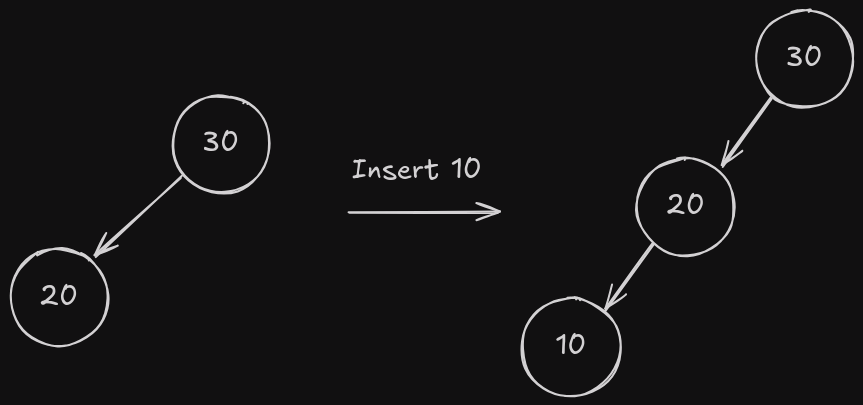
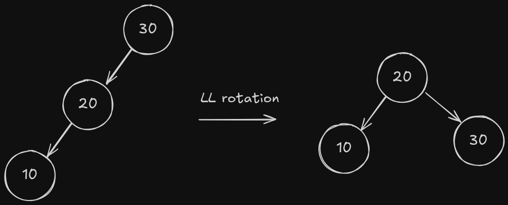
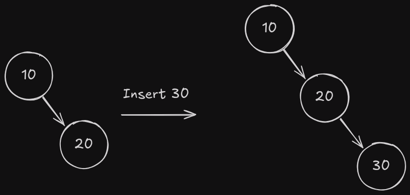
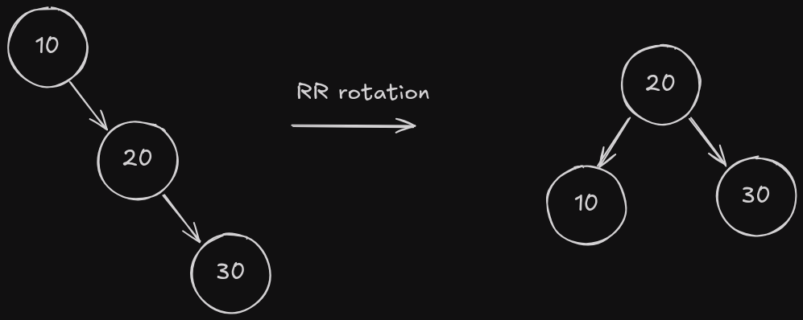
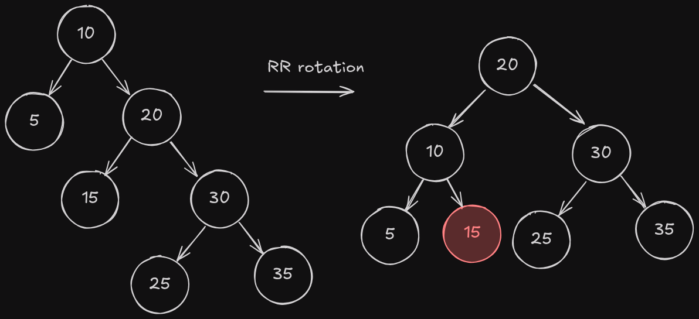
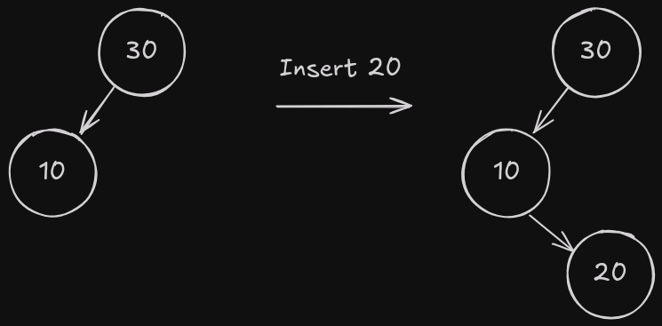
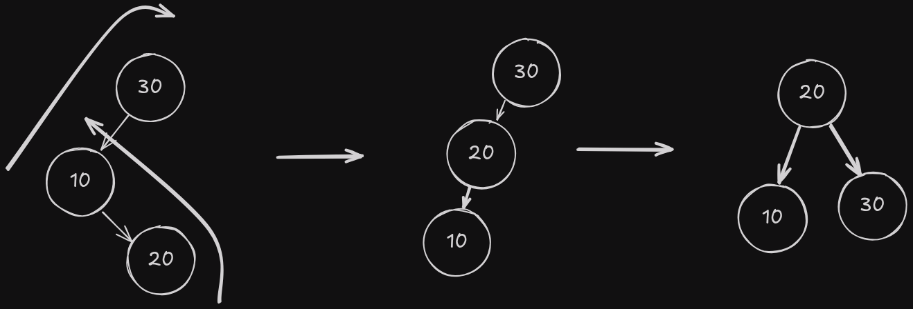
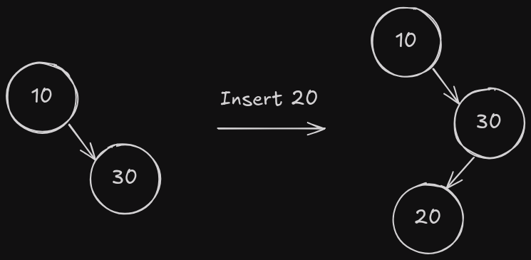
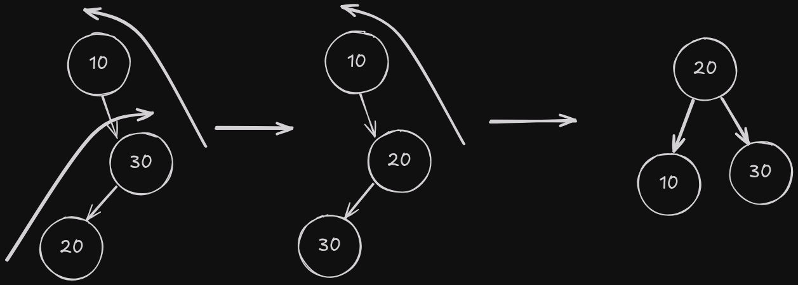
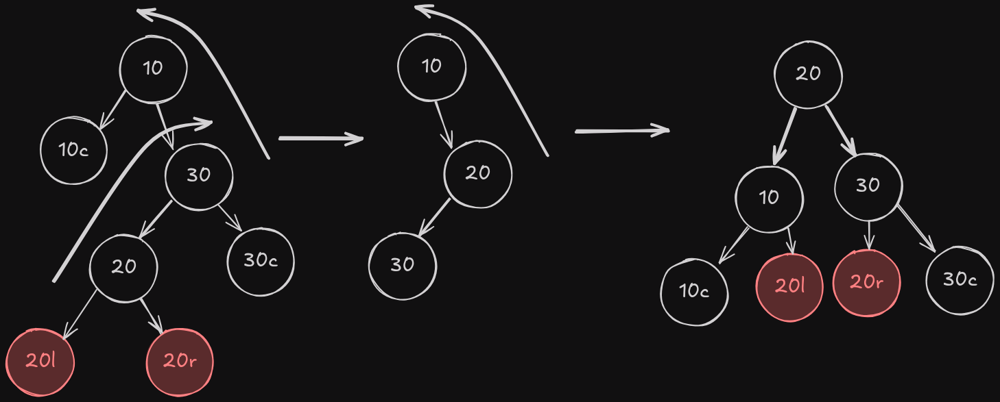

# AVL Tree

First of all I recommend you to read the [Binary Search Tree](../binarySearchTree/README.md) article.

And secondly, I recommend to watch this amazing video of Adbul Bari explaining the theory of AVL Trees and how the balancing and operations work.

[](https://www.youtube.com/watch?v=jDM6_TnYIqE)

An AVL tree is a self-balancing binary search tree (BST) where the difference between heights of left and right subtrees for any node cannot be more than one. This balance condition ensures that the time complexity of operations remains O(log n).

## Why AVL Trees?

Regular BSTs can become unbalanced, leading to worst-case time complexity of O(n) for operations like search, insert and delete. AVL trees are self-balancing and maintain O(log n) time complexity for these operations. because it ensures that the height of the tree remains O(log n).

## A bit of theory

AVL trees are named after their inventors Adelson-Velsky and Landis. An AVL tree is a binary search tree where each node has a balance factor, which is the difference between the height of the left subtree and the height of the right subtree. The balance factor of any node is either -1, 0 or 1. If the balance factor of any node is not -1, 0 or 1, the tree is unbalanced and rotations are required to balance the tree.

How to know what kind of rotation to do? It depends on the balance factor of the node and its children. There are four possible cases:

1. Left-Left (LL) case: A node has a balance factor of 2 and its left child has a balance factor of 1 or 0.
2. Right-Right (RR) case: A node has a balance factor of -2 and its right child has a balance factor of -1 or 0.
3. Left-Right (LR) case: A node has a balance factor of 2 and its left child has a balance factor of -1.
4. Right-Left (RL) case: A node has a balance factor of -2 and its right child has a balance factor of 1.

### LL Rotation

In the LL rotation, the left child of the unbalanced node becomes the new root of the subtree, and the unbalanced node becomes the right child of the new root.

This image shes when to do a LL rotation:



And this image shows the result of the LL rotation:



So as you can see, we take the umbalance node and make it the right child of the left child.

### RR Rotation

In the RR rotation, the right child of the unbalanced node becomes the new root of the subtree, and the unbalanced node becomes the left child of the new root.

This image shes when to do a RR rotation:



And this image shows the result of the RR rotation:



So as you can see, we take the umbalance node and make it the left child of the right child.

#### Considerations for LL and RR Rotations

In this two cases there's a special consideration to take into account when the node that becomes the new root has a right (or left) child, in this case we need to make the right (or left) child of the new root the left (or right) child of the old root.



### LR Rotation

In the LR rotation, we first do a RR rotation on the left child of the unbalanced node, and then we do a LL rotation on the unbalanced node.

This image shes when to do a LR rotation:



And this image shows the result of the LR rotation:



### RL Rotation

In the RL rotation, we first do a LL rotation on the right child of the unbalanced node, and then we do a RR rotation on the unbalanced node.

This image shes when to do a RL rotation:



And this image shows the result of the RL rotation:



#### Considerations for LR and RL Rotations

In this two cases there's a special consideration to take into account when the node that becomes the new root has a right (or left) child, in this case we need to make the right (or left) child of the new root the left (or right) child of the old root.



## Rotations in code

### LL Rotation C++

```cpp
avlTree::Nodo* avlTree::llRotation(Nodo* nodo) {
  Nodo* newRoot = nodo->left;
  Nodo* rootRight = newRoot->right;

  newRoot->right = nodo;
  nodo->left = rootRight;

  nodo->height = max(getHeight(nodo->left), getHeight(nodo->right)) + 1;
  newRoot->height =
      max(getHeight(newRoot->left), getHeight(newRoot->right)) + 1;

  return newRoot;
}
```

This function does a left-left rotation on the given node. It takes the left child of the node as the new root, then it takes the right child of the new root and makes it the left child of the old root. Finally, it updates the height of the old root and the new root.

### RR Rotation C++

```cpp
avlTree::Nodo* avlTree::rrRotation(Nodo* nodo) {
  Nodo* newRoot = nodo->right;
  Nodo* rootLeft = newRoot->left;

  newRoot->left = nodo;
  nodo->right = rootLeft;

  newRoot->height =
      max(getHeight(newRoot->left), getHeight(newRoot->right)) + 1;
  nodo->height = max(getHeight(nodo->left), getHeight(nodo->right)) + 1;

  return newRoot;
}
```

This function does a right-right rotation on the given node. It takes the right child of the node as the new root, then it takes the left child of the new root and makes it the right child of the old root. Finally, it updates the height of the old root and the new root.

### LR Rotation C++

```cpp
avlTree::Nodo* avlTree::lrRotation(Nodo* nodo) {
  nodo->left = rrRotation(nodo->left);
  return llRotation(nodo);
}
```

This function does a left-right rotation on the given node. It first does a right-right rotation on the left child of the node, then it does a left-left rotation on the node.

### RL Rotation C++

```cpp
avlTree::Nodo* avlTree::rlRotation(Nodo* nodo) {
  nodo->right = llRotation(nodo->right);
  return rrRotation(nodo);
}
```

This function does a right-left rotation on the given node. It first does a left-left rotation on the right child of the node, then it does a right-right rotation on the node.

We also use an auxiliary function to get the height of a node:

```cpp
int avlTree::getHeight(Nodo* nodo) {
  int leftH, rightH;
  if (nodo == nullptr) {
    return 0;
  }
  leftH = getHeight(nodo->left);
  rightH = getHeight(nodo->right);
  return max(leftH, rightH) + 1;
}
```

This function returns the height of the given node. If the node is null, it returns 0. Otherwise, it calculates the height of the left and right subtrees and returns the maximum height plus 1.

## Operations on AVL Trees

### Insert

```cpp
void avlTree::insert(int val) { root = insert(root, val); }
avlTree::Nodo* avlTree::insert(Nodo* nodo, int val) {
  int leftHeight, rightHeight, balanceFactor;
  if (nodo == nullptr) {
    return new Nodo(val);
  }
  if (val < nodo->value)
    nodo->left = insert(nodo->left, val);
  else
    nodo->right = insert(nodo->right, val);

  nodo->height = 1 + max(getHeight(nodo->left), getHeight(nodo->right));

  leftHeight = getHeight(nodo->left);
  rightHeight = getHeight(nodo->right);
  balanceFactor = leftHeight - rightHeight;

  if (balanceFactor < -1 && val > nodo->right->value) return rrRotation(nodo);
  if (balanceFactor > 1 && val < nodo->left->value) return llRotation(nodo);

  if (balanceFactor > 1 && val > nodo->left->value) return lrRotation(nodo);
  if (balanceFactor < -1 && val < nodo->right->value) return rlRotation(nodo);

  return nodo;
}
```

This function inserts a new node with the given value in the AVL tree. It first inserts the node recursively in the left or right subtree depending on the value of the node. Then it updates the height of the node and calculates the balance factor. If the balance factor is less than -1 and the value is greater than the right child, it does a right-right rotation. If the balance factor is greater than 1 and the value is less than the left child, it does a left-left rotation. If the balance factor is greater than 1 and the value is greater than the left child, it does a left-right rotation. If the balance factor is less than -1 and the value is less than the right child, it does a right-left rotation.

Step by step:

```cpp
  if (nodo == nullptr) {
    return new Nodo(val);
  }
```

If the node is null, we create a new node with the given value.

```cpp
  if (val < nodo->value)
    nodo->left = insert(nodo->left, val);
  else
    nodo->right = insert(nodo->right, val);
```

If the value is less than the current node, we insert it in the left subtree, otherwise we insert it in the right subtree.

```cpp
  nodo->height = 1 + max(getHeight(nodo->left), getHeight(nodo->right));
```

We update the height of the current node.

```cpp
  leftHeight = getHeight(nodo->left);
  rightHeight = getHeight(nodo->right);
  balanceFactor = leftHeight - rightHeight;
```

We calculate the height of the left and right subtrees and the balance factor.

```cpp
  if (balanceFactor < -1 && val > nodo->right->value) return rrRotation(nodo);
  if (balanceFactor > 1 && val < nodo->left->value) return llRotation(nodo);

  if (balanceFactor > 1 && val > nodo->left->value) return lrRotation(nodo);
  if (balanceFactor < -1 && val < nodo->right->value) return rlRotation(nodo);
```

If the balance factor is less than -1 and the value is greater than the right child, we do a right-right rotation. If the balance factor is greater than 1 and the value is less than the left child, we do a left-left rotation. If the balance factor is greater than 1 and the value is greater than the left child, we do a left-right rotation. If the balance factor is less than -1 and the value is less than the right child, we do a right-left rotation.

### Delete

```cpp
void avlTree::deleteNode(int val) { root = deleteNode(root, val); }
avlTree::Nodo* avlTree::deleteNode(Nodo* node, int val) {
  int leftHeight, rightHeight, balanceFactor;
  if (node == nullptr) {
    return nullptr;
  }
  if (val < node->value) {
    node->left = deleteNode(node->left, val);
  } else if (val > node->value) {
    node->right = deleteNode(node->right, val);
  } else {
    if (node->left == nullptr && node->right == nullptr) {
      delete node;
      return nullptr;
    } else if (node->left == nullptr || node->right == nullptr) {
      Nodo* temp = node->left ? node->left : node->right;
      delete node;
      return temp;
    } else {
      // tiene dos hijos
      Nodo* sucesor = node->right;
      while (sucesor->left != nullptr) {
        sucesor = sucesor->left;
      }
      node->value = sucesor->value;
      node->right = deleteNode(node->right, sucesor->value);
    }
  }
  node->height = 1 + max(getHeight(node->left), getHeight(node->right));
  leftHeight = getHeight(node->left);
  rightHeight = getHeight(node->right);
  balanceFactor = leftHeight - rightHeight;

  if (balanceFactor > 1) {
    int leftChildBalance =
        getHeight(node->left->left) - getHeight(node->left->right);
    if (leftChildBalance >= 0)
      return llRotation(node);
    else
      return lrRotation(node);
  }
  if (balanceFactor < -1) {
    int rightChildBalance =
        getHeight(node->right->left) - getHeight(node->right->right);
    if (rightChildBalance <= 0)
      return rrRotation(node);
    else
      return rlRotation(node);
  }

  return node;
}
```

This function deletes a node with the given value from the AVL tree. It first deletes the node recursively in the left or right subtree depending on the value of the node. Then it updates the height of the node and calculates the balance factor. If the balance factor is greater than 1, it calculates the balance factor of the left child and does a left-left or left-right rotation. If the balance factor is less than -1, it calculates the balance factor of the right child and does a right-right or right-left rotation.

Step by step:

```cpp
  if (node == nullptr) {
    return nullptr;
  }
```

If the node is null, we return null.

```cpp
  if (val < node->value) {
    node->left = deleteNode(node->left, val);
  } else if (val > node->value) {
    node->right = deleteNode(node->right, val);
  } else {
    if (node->left == nullptr && node->right == nullptr) {
      delete node;
      return nullptr;
    } else if (node->left == nullptr || node->right == nullptr) {
      Nodo* temp = node->left ? node->left : node->right;
      delete node;
      return temp;
    } else {
      // tiene dos hijos
      Nodo* sucesor = node->right;
      while (sucesor->left != nullptr) {
        sucesor = sucesor->left;
      }
      node->value = sucesor->value;
      node->right = deleteNode(node->right, sucesor->value);
    }
  }
```

If the value is less than the current node, we delete it in the left subtree. If the value is greater than the current node, we delete it in the right subtree. If the node has no children, we delete it and return null. If the node has one child, we delete it and return the child. If the node has two children, we find the successor, replace the value of the node with the value of the successor, and delete the successor.

```cpp
  node->height = 1 + max(getHeight(node->left), getHeight(node->right));
  leftHeight = getHeight(node->left);
  rightHeight = getHeight(node->right);
  balanceFactor = leftHeight - rightHeight;
```

We update the height of the current node and calculate the balance factor.

```cpp
  if (balanceFactor > 1) {
    int leftChildBalance =
        getHeight(node->left->left) - getHeight(node->left->right);
    if (leftChildBalance >= 0)
      return llRotation(node);
    else
      return lrRotation(node);
  }
  if (balanceFactor < -1) {
    int rightChildBalance =
        getHeight(node->right->left) - getHeight(node->right->right);
    if (rightChildBalance <= 0)
      return rrRotation(node);
    else
      return rlRotation(node);
  }
```

If the balance factor is greater than 1, we calculate the balance factor of the left child and do a left-left or left-right rotation. If the balance factor is less than -1, we calculate the balance factor of the right child and do a right-right or right-left rotation.

### Generate Graphviz

```cpp
void avlTree::generateGraphviz() const {
  ofstream file;
  file.open("./utils/graphviz/avlTree.dot");
  if (file.is_open()) {
    file << "digraph g {" << endl;
    file << "node [shape=circle, style=filled, fontname=\"Helvetica\"];"
         << endl;
    generateGraphviz(file, root);
    file << "rankdir=TB;" << endl;
    file << "nodesep = 0.1" << endl;
    file << "}" << endl;
  }
  file.close();
}
void avlTree::generateGraphviz(ofstream& file, Nodo* node) const {
  if (node == nullptr) {
    return;
  }
  file << "\"" << node << "\"" << "[label=\"" << node->value << "("
       << node->height << ")" << "\"];" << endl;

  // si el nodo, tiene hijo izquierdo
  if (node->left) {
    file << "\"" << node << "\"" << "->" << "\"" << node->left << "\""
         << "[label=\"L\", color=black]" << endl;
    generateGraphviz(file, node->left);
  }
  if (node->right) {
    file << "\"" << node << "\"" << "->" << "\"" << node->right << "\""
         << "[label=\"R\", color=black]" << endl;
    generateGraphviz(file, node->right);
  }
}
```

This function generates a Graphviz file that represents the AVL tree. It first opens the file and writes the header of the file. Then it calls the auxiliary function to generate the graph recursively. Finally, it writes the footer of the file and closes it.

The auxiliary function generates the graph recursively. It writes the node with its value and height. Then it writes the edges to the left and right children. If the node has a left child, it generates the graph recursively for the left child. If the node has a right child, it generates the graph recursively for the right child.

## Time Complexity

The time complexity of the insert and delete operations on an AVL tree is O(log n) because the height of the tree remains O(log n) due to the balancing condition. The time complexity of the search operation is also O(log n) because it depends on the height of the tree.

## Conclusion

AVL trees are self-balancing binary search trees that maintain O(log n) time complexity for operations like search, insert and delete. They use rotations to balance the tree and ensure that the height of the tree remains O(log n). AVL trees are a good choice when you need to perform operations like search, insert and delete efficiently on a dynamic set of data.

## References

- [AVL Tree - Wikipedia](https://en.wikipedia.org/wiki/AVL_tree)
- [AVL Tree - GeeksforGeeks](https://www.geeksforgeeks.org/avl-tree-set-1-insertion/)
- [AVL Tree - Abdul Bari](https://www.youtube.com/watch?v=jDM6_TnYIqE)
