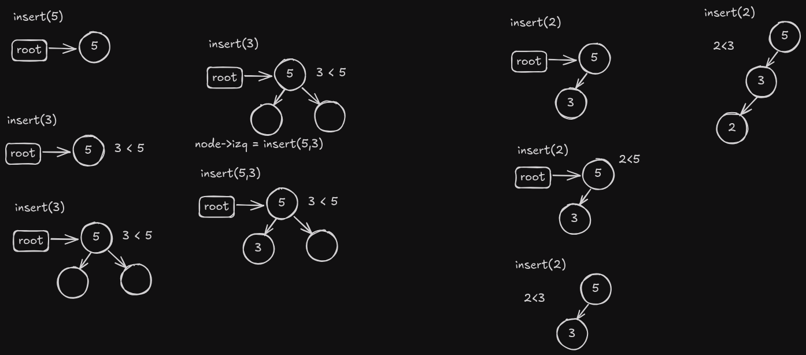

# Binary Search Tree

A binary search tree is a binary tree in which every node fits a specific ordering property: all left descendents <= n < all right descendents. This must be true for each node n.

This data structure provides efficient insertion, deletion, and search operations. It is also known as an ordered binary tree.

## Properties

- The left subtree of a node contains only nodes with keys lesser than the node’s key.
- The right subtree of a node contains only nodes with keys greater than the node’s key.
- The left and right subtree each must also be a binary search tree.

To be able to understand the binary search tree, we need to understand the following terms:

- **Root**: The top node in a tree.
- **Parent**: Any node except the root node has one edge upward to a node called a parent.
- **Child**: The node below a given node connected by its edge downward is called a child node.
- **Leaf**: The node which does not have any child node is called the leaf node.
- **Subtree**: A subtree is a tree that exists within a tree.

One of the most important things to know when working with binary search trees is **recursion**. Recursion is a technique in which a function calls itself as a subroutine. This allows us to break down complex problems into simpler problems that are easier to solve.

### Recursion

Any function which calls itself is called recursive. A recursive method solves a problem by
calling a copy of itself to work on a smaller problem. This is called the recursion step. The
recursion step can result in many more such recursive calls.

Recursion is a useful technique borrowed from mathematics. Recursive code is generally shorter
and easier to write than iterative code. Generally, loops are turned into recursive functions when they are compiled or interpreted.

A recursive function performs a task in part by calling itself to perform the subtasks. At some
point, the function encounters a subtask that it can perform without calling itself. This case, where the function does not recur, is called the base case. The former, where the function calls itself to perform a subtask, is referred to as the ecursive case. We can write all recursive functions using the format. (Data Structures and Algorithms made easy: Data Structures and Algorithmic Puzzles, Narasimha Karumanchi)

```cpp
void recursiveFunction(parameters) {
    if (base case) {
        // base case
        return some base case value;
    } else if (other base case) {
        // other base case
        return some other base case value;
    } else {
        // recursive case
        recursiveFunction(modified parameters);
    }
}
```

Another important thing to have in mind is the level of a node. The level of a node is the number of edges on the path from the root node to that node. The root node is at level 0.

And the time complexity of the binary search tree operations is O(h), where h is the height of the tree. The height of the tree is the number of edges on the longest path from the root node to a leaf node.

## The node structure

The node structure is the basic building block of a binary search tree. It contains the following fields:

- **value**: The data to be stored in the node.
- **left**: A pointer to the left child node.
- **right**: A pointer to the right child node.
- **count**: The number of times the value is present in the tree, this is helpful when we allow duplicates in the tree.

```cpp
  struct Nodo {
    Nodo* left;
    Nodo* right;
    int value;
    int count;
    Nodo(int val) : left(nullptr), right(nullptr), value(val), count(1) {}
  };
```

## Operations

### Insertion

Insertion is the process of adding a new node to the binary search tree. The new node is added according to the value of the node. If the value of the new node is less than the value of the current node, it is added to the left subtree. If the value of the new node is greater than the value of the current node, it is added to the right subtree.

There are multiple cases to consider when inserting a new node:

1. If the tree is empty, the new node becomes the root node.

2. If the value already exists in the tree, we increment the count of the node.

3. If the value is less than the current node, we recursively insert the value in the left subtree.

4. If the value is greater than the current node, we recursively insert the value in the right subtree.

```cpp
void binarySearchTree::insert(int val) { root = insert(root, val); }
binarySearchTree::Nodo* binarySearchTree::insert(Nodo* node, int val) {
  if (node == nullptr) {
    return new Nodo(val);
  }
  if (val == node->value) {
    node->count++;
    return node;
  }
  if (val < node->value)
    node->left = insert(node->left, val);
  else
    node->right = insert(node->right, val);

  return node;
}
```

As you can see, we start with the function that's being called from the main program. This function calls the recursive function that will do the actual insertion. The recursive function will return the node that was inserted or the node that was passed to it.

First we check if the node is null, if it is, we create a new node with the value and return it. If the value is equal to the current node, we increment the count and return the node.

If the value is less than the current node, we change the left of the current node to the result of the recursive call with the left of the current node and the value. If the value is greater than the current node, we change the right of the current node to the result of the recursive call with the right of the current node and the value.

This can be vizualized in this image:



### Deletion

Deletion is the process of removing a node from the binary search tree. There are three cases to consider when deleting a node:

1. If the node to be deleted is a leaf node, we simply remove it.

2. If the node to be deleted has only one child, we remove the node and replace it with its child.

3. If the node to be deleted has two children, we find the inorder successor of the node. The inorder successor is the smallest node in the right subtree of the node to be deleted. We copy the value of the inorder successor to the node to be deleted and delete the inorder successor.

```cpp
void binarySearchTree::deleteNode(int val) { root = deleteNode(root, val); }
binarySearchTree::Nodo* binarySearchTree::deleteNode(Nodo* node, int val) {
  if (node == nullptr) {
    return nullptr;
  }
  if (val > node->value) {
    node->right = deleteNode(node->right, val);
  } else if (val < node->value) {
    node->left = deleteNode(node->left, val);
  }
  if (val == node->value) {
    // aca eliminar el nodo
    if (node->count > 1) {
      node->count--;
      return node;
    }
    if (node->left == nullptr && node->right == nullptr) {
      // es hoja
      delete node;
      return nullptr;
    } else if (node->left == nullptr || node->right == nullptr) {
      // tiene un solo hijo
      Nodo* temp = node->left ? node->left : node->right;
      delete node;
      return temp;
    } else {
      // tiene dos hijos
      Nodo* sucesor = node->right;
      while (sucesor->left != nullptr) {
        sucesor = sucesor->left;
      }

      node->value = sucesor->value;
      node->count = sucesor->count;

      // En esta parte basicamente lo que esta pasando es que se busca el nodo
      // menor del lado izquierdo del arbol, es decir el nodo mas a la izquierda
      // de los hijos derechos del nodo y luego no se elimina fisicamente el
      // nodo, sino que se cambia el valor por este, y luego se procede a
      // eliminar el nodo mas pequeño del lado derecho del nodo que se esta
      // buscando eliminar

      node->right = deleteNode(node->right, sucesor->value);
    }
  }
  return node;
}
```

As you can see, we check for the multiple cases, if the node is null, we return null. If the node has only one child, we return the child. If the node is a leaf, we delete it and return null.

But if the node has two children, we basically find the least node in the right subtree of the node to be deleted, copy its value to the node to be deleted, and delete the least node in the right subtree of the node to be deleted.

As you can see we don't really delete the node, we just change its value and then delete the least node in the right subtree of the node to be deleted.

### Searching

Searching is the process of finding a node with a specific value in the binary search tree. We start at the root node and compare the value with the value of the current node. If the value is less than the value of the current node, we search in the left subtree. If the value is greater than the value of the current node, we search in the right subtree. If the value is equal to the value of the current node, we return the node.

```cpp
binarySearchTree::Nodo* binarySearchTree::search(int val) { return search(root, val); }
binarySearchTree::Nodo* binarySearchTree::search(Nodo* node, int val) {
  if (node == nullptr || node->value == val) {
    return node;
  }
  if (val > node->value) {
    return search(node->right, val);
  } else if (val < node->value) {
    return search(node->left, val);
  }
}
```

As you can see, we start with the function that's being called from the main program. This function calls the recursive function that will do the actual search. The recursive function will return the node that was found or null.

We just check if the node is greater than the value and we continue the search in the right subtree. If the node is less than the value, we continue the search in the left subtree. If the node is equal to the value, we return the node, we do this with every subtree until we find the node or we reach a null node.

### Traversal

Traversal is the process of visiting all the nodes in the binary search tree. There are three types of traversal:

1. **Inorder**: In this traversal, we first visit the left subtree, then the root node, and finally the right subtree.

2. **Preorder**: In this traversal, we first visit the root node, then the left subtree, and finally the right subtree.

3. **Postorder**: In this traversal, we first visit the left subtree, then the right subtree, and finally the root node.

#### Inorder

```cpp
void binarySearchTree::inorder() { inorder(root); }
void binarySearchTree::inorder(Nodo* node) {
  if (node == nullptr) return;
  inorder(node->left);
  cout << node->value << " ";
  inorder(node->right);
}
```

#### Preorder

```cppvoid binarySearchTree::preorder() { preorder(root); }
void binarySearchTree::preorder(Nodo* node) {
  if (node == nullptr) return;
  cout << node->value << " ";
  preorder(node->left);
  preorder(node->right);
}
```

#### Postorder

```cpp
void binarySearchTree::postorder() { postorder(root); }
void binarySearchTree::postorder(Nodo* node) {
  if (node == nullptr) return;
  postorder(node->left);
  postorder(node->right);
  cout << node->value << " ";
}
```

### Get Maximun node

```cpp
int binarySearchTree::findMax(Nodo* node) {
  while (node->right != nullptr) {
    node = node->right;
  }
  return node->value;
}
```

In this case we just search for the rightmost node in the tree, this node will be the maximum node in the tree.

### Get Minimum node

```cpp
int binarySearchTree::findMin(Nodo* node) {
  while (node->left != nullptr) {
    node = node->left;
  }
  return node->value;
}
```

In this case we just search for the leftmost node in the tree, this node will be the minimum node in the tree.

### Generate Graphviz file

```cpp
void binarySearchTree::generateGraphviz() const {
  ofstream file;
  file.open("./utils/graphviz/binarySearchTree.dot");
  if (file.is_open()) {
    file << "digraph g {" << endl;
    file << "node [shape=circle, style=filled, fontname=\"Helvetica\"];"
         << endl;
    generateGraphviz(file, root);
    file << "rankdir=TB;" << endl;
    file << "nodesep = 0.1" << endl;
    file << "}" << endl;
  }
  file.close();
}
void binarySearchTree::generateGraphviz(ofstream& file, Nodo* node) const {
  if (node == nullptr) {
    return;
  }
  file << "\"" << node << "\"" << "[label=\"" << node->value << "("
       << node->count << ")" << "\"];" << endl;

  // si el nodo, tiene hijo izquierdo
  if (node->left) {
    file << "\"" << node << "\"" << "->" << "\"" << node->left << "\""
         << "[label=\"L\", color=black]" << endl;
    generateGraphviz(file, node->left);
  }
  if (node->right) {
    file << "\"" << node << "\"" << "->" << "\"" << node->right << "\""
         << "[label=\"R\", color=black]" << endl;
    generateGraphviz(file, node->right);
  }
}
```

This function generates a graphviz file that can be used to visualize the binary search tree. This is very useful when debugging the binary search tree.

This functions does a preorder traversal of the tree and writes the nodes to the file.

## Complexity

The time complexity of the binary search tree operations is O(h), where h is the height of the tree. The height of the tree is the number of edges on the longest path from the root node to a leaf node.

The space complexity of the binary search tree operations is O(n), where n is the number of nodes in the tree.

## References

- [Wikipedia](https://en.wikipedia.org/wiki/Binary_search_tree)
- [GeeksforGeeks](https://www.geeksforgeeks.org/binary-search-tree-data-structure/)
- [Data Structures and Algorithms made easy: Data Structures and Algorithmic Puzzles, Narasimha Karumanchi](https://www.amazon.com/Data-Structures-Algorithms-Made-Easy/dp/1468101277)
