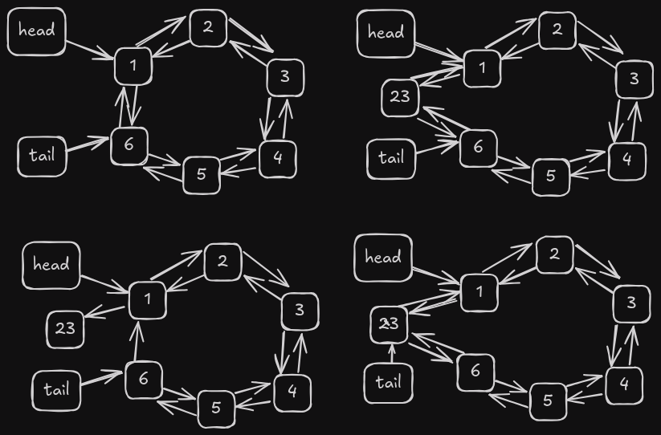

# Lista Doblemente Enlazada Circular

Una lista doblemente enlazada circular es una lista que tiene referencias tanto al nodo siguiente como al anterior. El último nodo de la lista apunta al primer nodo y el primer nodo apunta al último nodo. Esto crea una lista circular.

## Ventajas de una lista doblemente enlazada circular

- La lista puede recorrerse en ambas direcciones
- La lista puede recorrerse desde el principio hasta el final y desde el final hasta el principio
- La lista puede utilizarse para implementar una cola o una pila

## Desventajas de una lista doblemente enlazada circular

- La lista requiere más memoria que una lista simplemente enlazada
- La lista requiere más tiempo para insertar y eliminar nodos que una lista simplemente enlazada

## Operaciones en una lista doblemente enlazada circular

### Insertar al Inicio

```cpp
int doublyCircularList::insertAtHead(int id) {
  Nodo* nuevo = new (std::nothrow) Nodo(id);
  if (!nuevo) return -1;
  if (tail == nullptr) {
    nuevo->next = nuevo;
    nuevo->prev = nuevo;
    head = nuevo;
    tail = nuevo;
  } else {
    nuevo->next = head;
    nuevo->prev = tail;

    tail->next = nuevo;
    head->prev = nuevo;

    head = nuevo;
  }
  counter++;
  return 1;
}
```

Esta operación inserta un nuevo nodo al inicio de la lista. El nuevo nodo se crea con el id proporcionado y se inserta al inicio de la lista. El nuevo nodo se enlaza con el inicio y el final de la lista.


La complejidad temporal de esta operación es O(1) porque el nuevo nodo se inserta al inicio de la lista y no requiere recorrerla.

### Eliminar al Inicio

```cpp
int doublyCircularList::deleteAtHead() {
  if (tail == nullptr) {
    cout << "Error lista vacia :(" << endl;
    return -1;
  } else if (head == tail) {
    delete head;
    head = nullptr;
    tail = nullptr;
  } else {
    tail->next = head->next;
    head->next->prev = tail;
    delete head;
    head = tail->next;
  }
  counter--;
  return 1;
}
```

Esta operación elimina el nodo al inicio de la lista. El nodo al inicio de la lista se elimina y el inicio de la lista se actualiza al siguiente nodo.


La complejidad temporal de esta operación es O(1) porque el nodo al inicio de la lista se elimina y no requiere recorrerla.

### Insertar al Final

```cpp
int doublyCircularList::insertAtTail(int id) {
  Nodo* nuevo = new (std::nothrow) Nodo(id);
  if (!nuevo) return -1;

  if (tail == nullptr) {
    head = nuevo;
    tail = nuevo;
    nuevo->next = nuevo;
    nuevo->prev = nuevo;
  } else {
    head->prev = nuevo;
    tail->next = nuevo;

    nuevo->next = head;
    nuevo->prev = tail;

    tail = nuevo;
  }
  counter++;
  return 1;
}
```

Esta operación inserta un nuevo nodo al final de la lista. El nuevo nodo se crea con el id proporcionado y se inserta al final de la lista. El nuevo nodo se enlaza con el inicio y el final de la lista.



La complejidad temporal de esta operación es O(1) porque el nuevo nodo se inserta al final de la lista y no requiere recorrerla.

### Eliminar al Final

```cpp
int doublyCircularList::deleteAtTail() {
  if (tail == nullptr) {
    cout << "Error, lista vacia" << endl;
    return -1;
  } else if (tail == head) {
    delete tail;
    head = nullptr;
    tail = nullptr;
  } else {
    head->prev = tail->prev;
    tail->prev->next = head;
    delete tail;
    tail = head->prev;
  }
  counter--;
  return 1;
}
```

Esta operación elimina el nodo al final de la lista. El nodo al final de la lista se elimina y el final de la lista se actualiza al nodo anterior.


La complejidad temporal de esta operación es O(1) porque el nodo al final de la lista se elimina y no requiere recorrerla.

### Insertar en Índice

```cpp
int doublyCircularList::insertAtIndex(int idx, int val) {
  Nodo* nuevo = new (std::nothrow) Nodo(val);
  if (!nuevo) return -1;
  if (tail == nullptr) {
    tail = nuevo;
    head = nuevo;
    nuevo->next = nuevo;
    nuevo->prev = nuevo;
  } else if (idx > counter || idx < 0) {
    cerr << "Error, Indice fuera de rango" << endl;
    return -1;
  } else if (idx == 0) {
    delete nuevo;
    insertAtHead(val);
    return 1;
  } else if (idx == counter) {
    delete nuevo;
    insertAtTail(val);
    return 1;
  } else {
    Nodo* actual = findNodeAtIndex(idx);
    nuevo->prev = actual->prev;
    nuevo->next = actual;

    actual->prev->next = nuevo;
    actual->prev = nuevo;
  }
  counter++;
  return 1;
}
```


Esta operación inserta un nuevo nodo en el índice dado en la lista. El nuevo nodo se crea con el id proporcionado y se inserta en el índice dado. El nuevo nodo se enlaza con los nodos anterior y siguiente en la lista.

El método findNodeAtIndex se utiliza para encontrar el nodo en el índice dado.

```cpp
doublyCircularList::Nodo* doublyCircularList::findNodeAtIndex(int idx) const {
  if (idx < 0 || idx >= counter) return nullptr;

  if (idx < counter / 2) {
    Nodo* actual = head;
    for (int i = 0; i < idx; ++i) actual = actual->next;
    return actual;
  } else {
    Nodo* actual = tail;
    for (int i = counter - 1; i > idx; --i) actual = actual->prev;
    return actual;
  }
}
```

Como se puede ver, esta función se utiliza para encontrar el nodo en el índice dado. La complejidad temporal de esta operación es O(n) porque la lista se recorre para encontrar el nodo en el índice dado, incluso con la optimización de recorrer la lista desde el inicio o el final dependiendo del índice.

Y la complejidad temporal general de esta operación es O(n) porque la lista se recorre para encontrar el nodo en el índice dado.

### Eliminar en Índice

```cpp
int doublyCircularList::deleteAtIndex(int idx) {
  if (tail == nullptr) {
    cerr << "Error, lista vacia" << endl;
    return -1;
  } else if (idx > counter - 1 || idx < 0) {
    cerr << "Error, indice fuera de rango" << endl;
    return -1;
  } else if (idx == 0) {
    deleteAtHead();
    return 1;
  } else if (idx == counter - 1) {
    deleteAtTail();
    return 1;
  } else {
    Nodo* actual = findNodeAtIndex(idx);
    actual->next->prev = actual->prev;
    actual->prev->next = actual->next;
    delete actual;
  }
  counter--;
  return 1;
}
```


Esta operación elimina el nodo en el índice dado en la lista. El nodo en el índice dado se elimina y los nodos anterior y siguiente se enlazan entre sí.

La complejidad temporal de esta operación es O(n) porque la lista se recorre para encontrar el nodo en el índice dado.

### Obtener Longitud

```cpp
int doublyCircularList::getLength() { return counter; }
```

Esta operación devuelve la longitud de la lista. La complejidad temporal de esta operación es O(1) porque la longitud de la lista se almacena en una variable.

### Buscar por Valor

```cpp
int doublyCircularList::search(int id) {
  if (head == nullptr) {
    cout << "Error, lista vacia" << endl;
    return -1;
  }
  Nodo* actual = head;
  int position = 0;
  do {
    if (actual->data == id) return position;
    position++;
    actual = actual->next;
  } while (actual != head);
  return -1;
}
```

Esta operación busca un nodo con el valor dado en la lista. La lista se recorre para encontrar el nodo con el valor dado. La complejidad temporal de esta operación es O(n) porque la lista se recorre para encontrar el nodo con el valor dado.

### Obtener Valor en Índice

```cpp
int doublyCircularList::get(int idx) {
  if (tail == nullptr) {
    return -1;
  } else if (idx > counter - 1 || idx < 0) {
    return -1;
  } else {
    Nodo* _nodo = findNodeAtIndex(idx);
    return _nodo->data;
  }
}
```

Esta operación devuelve el valor del nodo en el índice dado en la lista. La complejidad temporal de esta operación es O(n) porque la lista se recorre para encontrar el nodo en el índice dado.

### Generar Gráfico

```cpp
void doublyCircularList::generateGraphviz() {
  ofstream file;
  file.open("./utils/graphviz/doublyCircularList.dot");
  if (file.is_open()) {
    file << "digraph g {" << endl;
    file << "node [shape=box, style=filled, fontname=\"Helvetica\"];" << endl;

    // Nodos Head y Tail
    file << "Head [label=\"Head\",color=lightblue, fillcolor=lightblue];"
         << endl;
    file << "Tail [label=\"Tail\",color=lightblue, fillcolor=lightblue];"
         << endl;

    Nodo* actual = head;

    if (tail == nullptr) {
      file << "\"Empty List\"" << endl;
    } else if (head == tail) {
      file << "\"" << actual << "\"" << "[label=\"" << actual->data << "\"];"
           << endl;
      file << "Head ->" << "\"" << actual << "\"" << endl;
      file << "Tail ->" << "\"" << actual << "\"" << endl;
      file << "\"" << actual << "\"" << "->" << "\"" << actual << "\"" << endl;
      file << "\"" << actual << "\"" << "->" << "\"" << actual << "\"" << endl;
    } else {
      file << "Head ->" << "\"" << head << "\"" << endl;
      file << "Tail ->" << "\"" << tail << "\"" << endl;

      file << "\"" << actual << "\"" << "[label=\"" << actual->data << "\"];"
           << endl;

      file << "\"" << actual << "\"" << "->" << "\"" << actual->next << "\""
           << "[label=\"Next\", color=black]" << endl;
      file << "\"" << actual << "\"" << "->" << "\"" << actual->prev << "\""
           << "[label=\"Prev\", color=black]" << endl;

      actual = actual->next;
      while (actual != head) {
        file << "\"" << actual << "\"" << "[label=\"" << actual->data << "\"];"
             << endl;
        file << "\"" << actual << "\"" << "->" << "\"" << actual->next << "\""
             << "[label=\"Next\", color=black]" << endl;
        file << "\"" << actual << "\"" << "->" << "\"" << actual->prev << "\""
           << "[label=\"Prev\", color=black]" << endl;

        actual = actual->next;
      }
    }
    file << "rankdir=LR;" << endl;
    file << "nodesep = 0.1" << endl;
    file << "}" << endl;
  }
  file.close();
}
```

Esta operación genera un archivo Graphviz que representa la lista. El archivo Graphviz se guarda en la carpeta utils/graphviz con el nombre doublyCircularList.dot. La complejidad temporal de esta operación es O(n) porque la lista se recorre para generar el archivo Graphviz.

## Conclusión

Una lista doblemente enlazada circular es una lista que tiene referencias tanto al nodo siguiente como al anterior. El último nodo de la lista apunta al primer nodo y el primer nodo apunta al último nodo. Esto crea una lista circular.

La lista puede recorrerse en ambas direcciones, desde el principio hasta el final y desde el final hasta el principio. La lista puede utilizarse para implementar una cola o una pila.

La lista requiere más memoria que una lista simplemente enlazada y requiere más tiempo para insertar y eliminar nodos que una lista simplemente enlazada.

Las operaciones en una lista doblemente enlazada circular son insertar al inicio, eliminar al inicio, insertar al final, eliminar al final, insertar en índice, eliminar en índice, obtener longitud, buscar por valor, obtener valor en índice y generar Graphviz.

## Referencias

- [Lista Doblemente Enlazada](https://en.wikipedia.org/wiki/Doubly_linked_list)
- [Lista Enlazada Circular](https://en.wikipedia.org/wiki/Linked_list#Circular_linked_list)
- [Graphviz](https://graphviz.org/)
