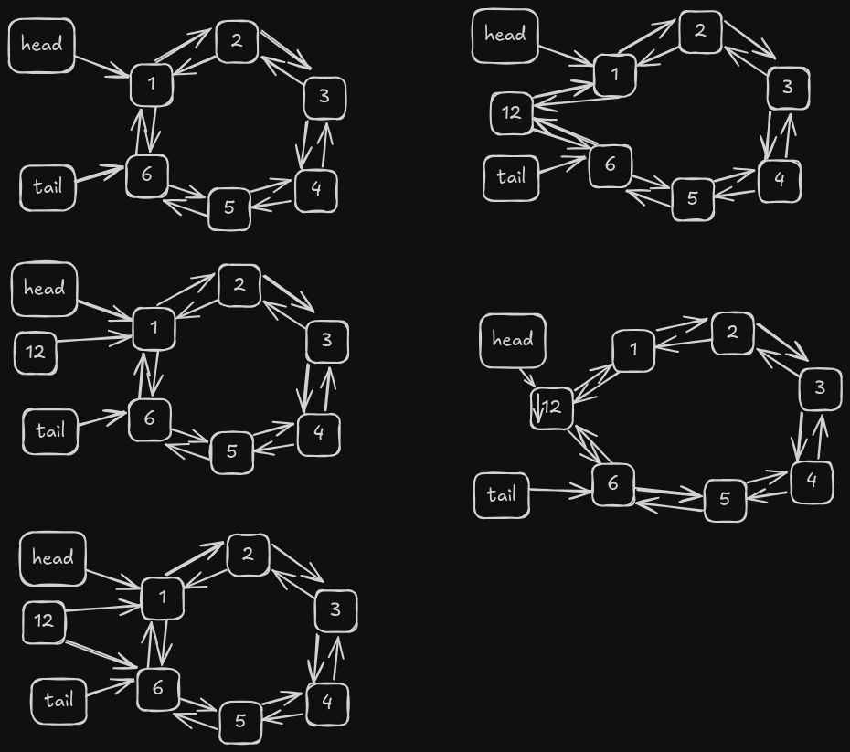
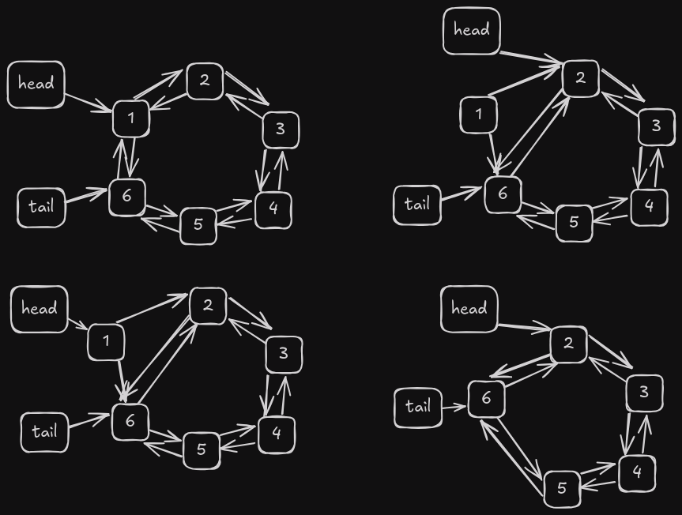
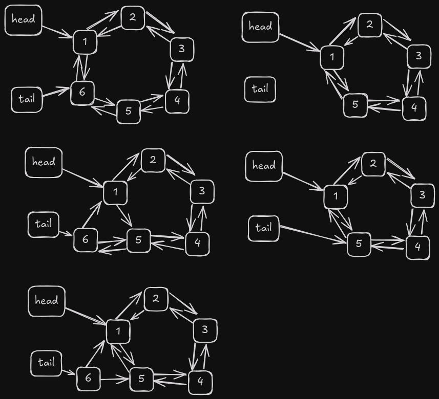
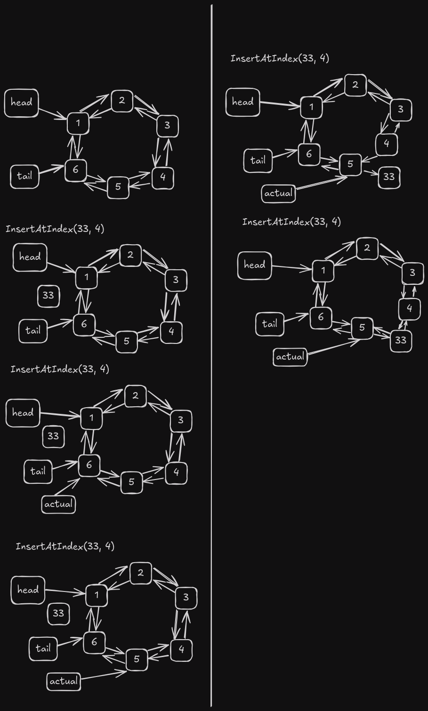

# Doubly Linked Circular List

A doubly linked circular list is a list that has a reference to the next and previous node in the list. The last node in the list points to the first node in the list and the first node in the list points to the last node in the list. This creates a circular list.

## Advantages of a doubly linked circular list

- The list can be traversed in both directions
- The list can be traversed from the beginning to the end and from the end to the beginning
- The list can be used to implement a queue or a stack

## Disadvantages of a doubly linked circular list

- The list requires more memory than a singly linked list
- The list requires more time to insert and delete nodes than a singly linked list

## Operations on a doubly linked circular list

### Insert at Head

```cpp
int doublyCircularList::insertAtHead(int id) {
  Nodo* nuevo = new (std::nothrow) Nodo(id);
  if (!nuevo) return -1;
  if (tail == nullptr) {
    nuevo->next = nuevo;
    nuevo->prev = nuevo;
    head = nuevo;
    tail = nuevo;
  } else {
    nuevo->next = head;
    nuevo->prev = tail;

    tail->next = nuevo;
    head->prev = nuevo;

    head = nuevo;
  }
  counter++;
  return 1;
}
```

This operation inserts a new node at the head of the list. The new node is created with the given id and is inserted at the head of the list. The new node is linked to the head of the list and the tail of the list.



The time complexity of this operation is O(1) because the new node is inserted at the head of the list and it does not require traversing the list.

### Delete at Head

```cpp
int doublyCircularList::deleteAtHead() {
  if (tail == nullptr) {
    cout << "Error lista vacia :(" << endl;
    return -1;
  } else if (head == tail) {
    delete head;
    head = nullptr;
    tail = nullptr;
  } else {
    tail->next = head->next;
    head->next->prev = tail;
    delete head;
    head = tail->next;
  }
  counter--;
  return 1;
}
```

This operation deletes the node at the head of the list. The node at the head of the list is deleted and the head of the list is updated to the next node in the list.



The time complexity of this operation is O(1) because the node at the head of the list is deleted and it does not require traversing the list.

### Insert at Tail

```cpp
int doublyCircularList::insertAtTail(int id) {
  Nodo* nuevo = new (std::nothrow) Nodo(id);
  if (!nuevo) return -1;

  if (tail == nullptr) {
    head = nuevo;
    tail = nuevo;
    nuevo->next = nuevo;
    nuevo->prev = nuevo;
  } else {
    head->prev = nuevo;
    tail->next = nuevo;

    nuevo->next = head;
    nuevo->prev = tail;

    tail = nuevo;
  }
  counter++;
  return 1;
}
```

This operation inserts a new node at the tail of the list. The new node is created with the given id and is inserted at the tail of the list. The new node is linked to the head of the list and the tail of the list.


The time complexity of this operation is O(1) because the new node is inserted at the tail of the list and it does not require traversing the list.

### Delete at Tail

```cpp
int doublyCircularList::deleteAtTail() {
  if (tail == nullptr) {
    cout << "Error, lista vacia" << endl;
    return -1;
  } else if (tail == head) {
    delete tail;
    head = nullptr;
    tail = nullptr;
  } else {
    head->prev = tail->prev;
    tail->prev->next = head;
    delete tail;
    tail = head->prev;
  }
  counter--;
  return 1;
}
```

This operation deletes the node at the tail of the list. The node at the tail of the list is deleted and the tail of the list is updated to the previous node in the list.



The time complexity of this operation is O(1) because the node at the tail of the list is deleted and it does not require traversing the list.

### Insert at Index

```cpp
int doublyCircularList::insertAtIndex(int idx, int val) {
  Nodo* nuevo = new (std::nothrow) Nodo(val);
  if (!nuevo) return -1;
  if (tail == nullptr) {
    tail = nuevo;
    head = nuevo;
    nuevo->next = nuevo;
    nuevo->prev = nuevo;
  } else if (idx > counter || idx < 0) {
    cerr << "Error, Indice fuera de rango" << endl;
    return -1;
  } else if (idx == 0) {
    delete nuevo;
    insertAtHead(val);
    return 1;
  } else if (idx == counter) {
    delete nuevo;
    insertAtTail(val);
    return 1;
  } else {
    Nodo* actual = findNodeAtIndex(idx);
    nuevo->prev = actual->prev;
    nuevo->next = actual;

    actual->prev->next = nuevo;
    actual->prev = nuevo;
  }
  counter++;
  return 1;
}
```



This operation inserts a new node at the given index in the list. The new node is created with the given id and is inserted at the given index in the list. The new node is linked to the previous and next nodes in the list.

The findNodeAtIndex method is used to find the node at the given index in the list.

```cpp
doublyCircularList::Nodo* doublyCircularList::findNodeAtIndex(int idx) const {
  if (idx < 0 || idx >= counter) return nullptr;

  if (idx < counter / 2) {
    Nodo* actual = head;
    for (int i = 0; i < idx; ++i) actual = actual->next;
    return actual;
  } else {
    Nodo* actual = tail;
    for (int i = counter - 1; i > idx; --i) actual = actual->prev;
    return actual;
  }
}
```

As you can see this function is used to find the node at the given index in the list. The time complexity of this operation is O(n) because the list is traversed to find the node at the given index, even with the optimization of traversing the list from the head or the tail depending on the index.

And the general time complexity of this operation is O(n) because the list is traversed to find the node at the given index.

### Delete at Index

```cpp
int doublyCircularList::deleteAtIndex(int idx) {
  if (tail == nullptr) {
    cerr << "Error, lista vacia" << endl;
    return -1;
  } else if (idx > counter - 1 || idx < 0) {
    cerr << "Error, indice fuera de rango" << endl;
    return -1;
  } else if (idx == 0) {
    deleteAtHead();
    return 1;
  } else if (idx == counter - 1) {
    deleteAtTail();
    return 1;
  } else {
    Nodo* actual = findNodeAtIndex(idx);
    actual->next->prev = actual->prev;
    actual->prev->next = actual->next;
    delete actual;
  }
  counter--;
  return 1;
}
```


This operation deletes the node at the given index in the list. The node at the given index in the list is deleted and the previous and next nodes in the list are linked.

The time complexity of this operation is O(n) because the list is traversed to find the node at the given index.

### Get Length

```cpp
int doublyCircularList::getLength() { return counter; }
```

This operation returns the length of the list. The time complexity of this operation is O(1) because the length of the list is stored in a variable.

### Search by Value

```cpp
int doublyCircularList::search(int id) {
  if (head == nullptr) {
    cout << "Error, lista vacia" << endl;
    return -1;
  }
  Nodo* actual = head;
  int position = 0;
  do {
    if (actual->data == id) return position;
    position++;
    actual = actual->next;
  } while (actual != head);
  return -1;
}
```

This operation searches for a node with the given value in the list. The list is traversed to find the node with the given value. The time complexity of this operation is O(n) because the list is traversed to find the node with the given value.


### Get Value at Index

```cpp
int doublyCircularList::get(int idx) {
  if (tail == nullptr) {
    return -1;
  } else if (idx > counter - 1 || idx < 0) {
    return -1;
  } else {
    Nodo* _nodo = findNodeAtIndex(idx);
    return _nodo->data;
  }
}
```

This operation returns the value of the node at the given index in the list. The time complexity of this operation is O(n) because the list is traversed to find the node at the given index.

### Generate Graph

```cpp
void doublyCircularList::generateGraphviz() {
  ofstream file;
  file.open("./utils/graphviz/doublyCircularList.dot");
  if (file.is_open()) {
    file << "digraph g {" << endl;
    file << "node [shape=box, style=filled, fontname=\"Helvetica\"];" << endl;

    // Head and Tail nodes
    file << "Head [label=\"Head\",color=lightblue, fillcolor=lightblue];"
         << endl;
    file << "Tail [label=\"Tail\",color=lightblue, fillcolor=lightblue];"
         << endl;

    Nodo* actual = head;

    if (tail == nullptr) {
      file << "\"Empty List\"" << endl;
    } else if (head == tail) {
      file << "\"" << actual << "\"" << "[label=\"" << actual->data << "\"];"
           << endl;
      file << "Head ->" << "\"" << actual << "\"" << endl;
      file << "Tail ->" << "\"" << actual << "\"" << endl;
      file << "\"" << actual << "\"" << "->" << "\"" << actual << "\"" << endl;
      file << "\"" << actual << "\"" << "->" << "\"" << actual << "\"" << endl;
    } else {
      file << "Head ->" << "\"" << head << "\"" << endl;
      file << "Tail ->" << "\"" << tail << "\"" << endl;

      file << "\"" << actual << "\"" << "[label=\"" << actual->data << "\"];"
           << endl;

      file << "\"" << actual << "\"" << "->" << "\"" << actual->next << "\""
           << "[label=\"Next\", color=black]" << endl;
      file << "\"" << actual << "\"" << "->" << "\"" << actual->prev << "\""
           << "[label=\"Prev\", color=black]" << endl;

      actual = actual->next;
      while (actual != head) {
        file << "\"" << actual << "\"" << "[label=\"" << actual->data << "\"];"
             << endl;
        file << "\"" << actual << "\"" << "->" << "\"" << actual->next << "\""
             << "[label=\"Next\", color=black]" << endl;
        file << "\"" << actual << "\"" << "->" << "\"" << actual->prev << "\""
             << "[label=\"Prev\", color=black]" << endl;

        actual = actual->next;
      }
    }
    file << "rankdir=LR;" << endl;
    file << "nodesep = 0.1" << endl;
    file << "}" << endl;
  }
  file.close();
}
```

This operation generates a Graphviz file that represents the list. The Graphviz file is saved in the utils/graphviz folder with the name doublyCircularList.dot. The time complexity of this operation is O(n) because the list is traversed to generate the Graphviz file.

## Conclusion

A doubly linked circular list is a list that has a reference to the next and previous node in the list. The last node in the list points to the first node in the list and the first node in the list points to the last node in the list. This creates a circular list.

The list can be traversed in both directions, from the beginning to the end and from the end to the beginning. The list can be used to implement a queue or a stack.

The list requires more memory than a singly linked list and requires more time to insert and delete nodes than a singly linked list.

The operations on a doubly linked circular list are insert at head, delete at head, insert at tail, delete at tail, insert at index, delete at index, get length, search by value, get value at index, and generate Graphviz.

## References

- [Doubly Linked List](https://en.wikipedia.org/wiki/Doubly_linked_list)
- [Circular Linked List](https://en.wikipedia.org/wiki/Linked_list#Circular_linked_list)
- [Graphviz](https://graphviz.org/)
