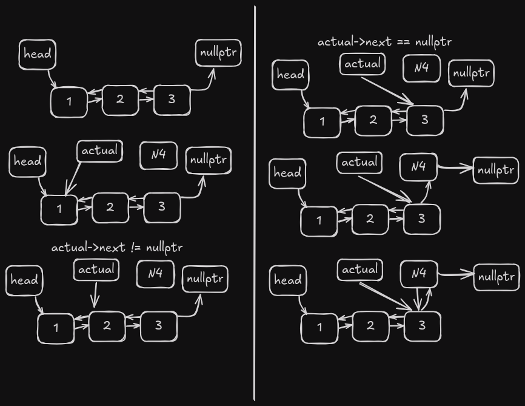
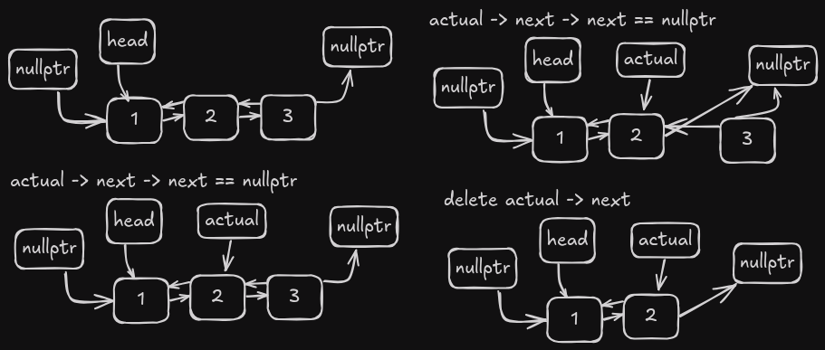
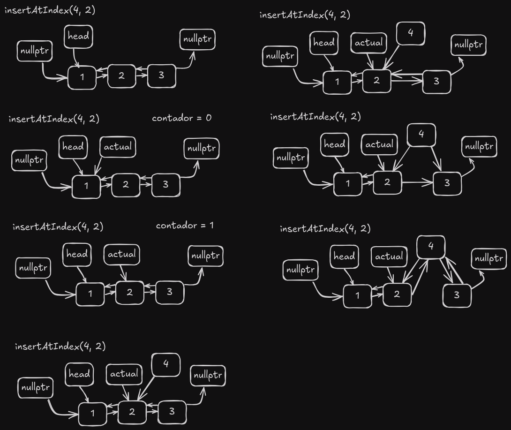

# Lista Doblemente Enlazada

Una lista doblemente enlazada es una estructura de datos que consiste en una secuencia de elementos en la que cada elemento tiene una referencia al elemento siguiente y al anterior en la secuencia. Esto permite operaciones eficientes de inserción y eliminación tanto al principio como al final de la lista.

## Ventajas de las Listas Doblemente Enlazadas sobre las Listas Simplemente Enlazadas

1. Recorrido bidireccional
2. Facilidad de inserción/eliminación en ambos extremos

## La clase nodo

```cpp
struct Node {
  int data;
  Node* next;
  Node* prev;
  Node(int d) : data(d), next(nullptr), prev(nullptr) {}
};
```

Como se mencionó anteriormente, la clase Node es el bloque de construcción de la lista doblemente enlazada. Cada objeto nodo debe contener tres campos: `data`, `next` y `prev`. El campo `data` almacenará el valor del elemento, el campo `next` es un puntero al siguiente nodo en la lista, y el campo `prev` es un puntero al nodo anterior en la lista.

Esto ayuda a crear una estructura tipo cadena donde cada nodo está conectado con los nodos siguiente y anterior. El primer nodo tendrá un campo `prev` con valor `null`, y el último nodo tendrá un campo `next` con valor `null`.


Como se puede ver, cada nodo apunta a los nodos siguiente y anterior, creando una estructura de lista doblemente enlazada.

## Operaciones en la Lista Doblemente Enlazada

### Insertar al Principio

```cpp
int doublyLinkedList::insertAtHead(int id) {
  Nodo* nuevo = new Nodo(id);
  nuevo->next = head;
  if (head != nullptr) {
    head->prev = nuevo;
  }
  head = nuevo;
  return 1;
}
```

Esto crea un nuevo nodo con los datos proporcionados, luego mueve el nodo que era la cabeza al campo next del nuevo nodo, y finalmente establece el nuevo nodo como la cabeza.


La complejidad temporal de esta operación es O(1) porque no depende del número de nodos en la lista.

### Eliminar al Principio

```cpp
int doublyLinkedList::deleteHead() {
  if (head == nullptr) {
    cout << "Lista Vacía" << endl;
    return 0;
  }
  Nodo* temp = head;
  head = temp->next;
  if (head != nullptr) {
    head->prev = nullptr;
  }
  delete temp;
  return 1;
}
```

Esta operación elimina el nodo cabeza moviendo la cabeza al siguiente nodo y estableciendo el campo prev del nuevo head a `nullptr`.


La complejidad temporal de esta operación es O(1) porque no depende del número de nodos en la lista.

### Insertar al Final

```cpp
int doublyLinkedList::insertAtEnd(int id) {
  if (head == nullptr) {
    insertAtHead(id);
    return 1;
  }
  Nodo* nuevo = new Nodo(id);
  Nodo* actual = head;
  while (actual->next != nullptr) {
    actual = actual->next;
  }
  actual->next = nuevo;
  nuevo->prev = actual;
  return 1;
}
```

Esta operación inserta un nuevo nodo al final de la lista recorriendo la lista hasta el último nodo y luego estableciendo el campo next del último nodo al nuevo nodo.



La complejidad temporal de esta operación es O(n) en el peor caso porque depende del número de nodos en la lista.

### Eliminar al Final

```cpp
int doublyLinkedList::deleteEnd() {
  if (head == nullptr) {
    return 0;
  }
  if (head->next == nullptr) {
    delete head;     // Liberar la memoria del único nodo.
    head = nullptr;  // Actualizar head a nullptr.
    return 1;
  }

  Nodo* actual = head;
  while (actual->next != nullptr && actual->next->next != nullptr) {
    actual = actual->next;
  }
  delete actual->next;
  actual->next = nullptr;
  return 1;
}
```

Esta operación elimina el último nodo de la lista recorriendo la lista hasta el penúltimo nodo y luego estableciendo el campo next del penúltimo nodo a `nullptr`.



La complejidad temporal de esta operación es O(n) en el peor caso porque depende del número de nodos en la lista.

### Insertar en Posición

```cpp
int doublyLinkedList::insertAtIndex(int id, int index) {
  if (head == nullptr) {
    return 0;
  }
  if (index == 0) {
    insertAtHead(id);
    return 1;
  }
  int contador = 0;
  Nodo* actual = head;
  while (contador + 1 != index && actual != nullptr) {
    actual = actual->next;
    contador++;
  }
  if (actual->next == nullptr) {
    insertAtEnd(id);
    return 1;
  }
  Nodo* nuevo = new Nodo(id);
  nuevo->prev = actual;
  nuevo->next = actual->next;
  actual->next->prev = nuevo;
  actual->next = nuevo;
  return 1;
}
```

Esta operación inserta un nuevo nodo en el índice especificado recorriendo la lista hasta el nodo anterior al índice especificado y luego estableciendo el campo next del nuevo nodo al nodo en el índice especificado.



La complejidad temporal de esta operación es O(n) en el peor caso porque depende del número de nodos en la lista.

### Eliminar en Posición

```cpp
int doublyLinkedList::deleteAtIndex(int index) {
  if (head == nullptr) {
    return 0;
  }
  if (index == 0) {
    deleteHead();
    return 1;
  }
  int contador = 0;
  Nodo* actual = head;
  while (contador + 1 != index && actual != nullptr) {
    actual = actual->next;
    contador++;
  }
  if (actual->next == nullptr || actual == nullptr) {
    return 0;  // índice fuera de rango
  }
  Nodo* temp = actual->next;
  actual->next = temp->next;

  if (temp->next != nullptr) {
    temp->next->prev = actual;
  }
  delete temp;
  return 1;
}
```

Esta operación elimina el nodo en el índice especificado recorriendo la lista hasta el nodo anterior al índice especificado y luego estableciendo el campo next del nodo anterior al índice especificado al nodo posterior al índice especificado.


La complejidad temporal de esta operación es O(n) en el peor caso porque depende del número de nodos en la lista.

### Obtener Tamaño

```cpp
int doublyLinkedList::getLength() {
  int contador = 0;
  Nodo* actual = head;
  while (actual != nullptr) {
    actual = actual->next;
    contador++;
  }
  return contador;
}
```

Esta operación devuelve el número de nodos en la lista recorriendo la lista y contando los nodos.

La complejidad temporal de esta operación es O(n) porque depende del número de nodos en la lista.

### Buscar

```cpp
int doublyLinkedList::search(int id) {
  Nodo* actual = head;
  int position = 0;

  while (actual != nullptr) {
    if (actual->data == id) {
      return position;
    }
    position++;
    actual = actual->next;
  }
}
```

Esta operación busca un nodo con los datos especificados recorriendo la lista y comparando los datos de cada nodo con los datos especificados.

La complejidad temporal de esta operación es O(n) porque depende del número de nodos en la lista.

### Obtener Elemento en Posición

```cpp
int doublyLinkedList::get(int index) {
  Nodo* actual = head;
  int contador = 0;
  while (actual != nullptr) {
    if (contador == index) {
      return actual->data;
    }
    actual = actual->next;
    contador++;
  }
  return -1;
}
```

Esta operación devuelve los datos del nodo en el índice especificado recorriendo la lista hasta el índice especificado y luego devolviendo los datos del nodo en ese índice.

La complejidad temporal de esta operación es O(n) porque depende del número de nodos en la lista.

### Generar Graphviz

```cpp
void doublyLinkedList::generateGraphviz() {
  ofstream archivo;
  archivo.open("./utils/graphviz/doublyLinkedList.dot");

  if (archivo.is_open()) {
    archivo << "digraph g {" << endl;
    archivo << "rankdir=LR;"
            << endl;  // Para que el grafo se dibuje de izquierda a derecha

    // Caso lista vacía
    if (head == nullptr) {
      archivo << "Empty [label=\"Lista Vacía\"];" << endl;
      archivo << "}" << endl;
      archivo.close();
      return;
    }

    // Nodos especiales
    archivo << "Head [label=\"head\"];" << endl;
    archivo << "null1 [label=\"nullptr\"];" << endl;
    archivo << "null2 [label=\"nullptr\"];" << endl;

    // Enlace desde head al primer nodo
    archivo << "Head -> \"" << head << "\";" << endl;

    // Recorrer la lista
    Nodo* actual = head;
    while (actual != nullptr) {
      // Crear nodo actual
      archivo << "\"" << actual << "\" [label=\"" << actual->data << "\"];"
              << endl;

      // Enlaces hacia adelante
      if (actual->next != nullptr) {
        archivo << "\"" << actual << "\" -> \"" << actual->next << "\";"
                << endl;
      } else {
        archivo << "\"" << actual << "\" -> null2;" << endl;
      }

      // Enlaces hacia atrás
      if (actual->prev != nullptr) {
        archivo << "\"" << actual << "\" -> \"" << actual->prev
                << "\" [constraint=false];" << endl;
      } else {
        archivo << "\"" << actual << "\" -> null1;" << endl;
      }

      actual = actual->next;
    }

    archivo << "}" << endl;
    archivo.close();
  }
}
```

Esta operación genera un archivo Graphviz que representa la lista doblemente enlazada. El archivo se guarda en el directorio `./utils/graphviz/doublyLinkedList.dot`.

La complejidad temporal de esta operación es O(n) porque depende del número de nodos en la lista.

## Conclusión

Las listas doblemente enlazadas son una estructura de datos poderosa que permite operaciones eficientes de inserción y eliminación en ambos extremos de la lista. Proporcionan recorrido bidireccional, lo cual puede ser útil en ciertos escenarios. Las operaciones en listas doblemente enlazadas tienen complejidades temporales que dependen del número de nodos en la lista, haciéndolas adecuadas para aplicaciones donde se requieren estructuras de datos dinámicas.

No son la mejor opción cuando se requiere acceso aleatorio a los elementos, ya que esta operación tiene una complejidad temporal de O(n).

## Referencias

- [Wikipedia - Lista Doblemente Enlazada](https://en.wikipedia.org/wiki/Doubly_linked_list)
- [GeeksforGeeks - Lista Doblemente Enlazada](https://www.geeksforgeeks.org/doubly-linked-list/)
