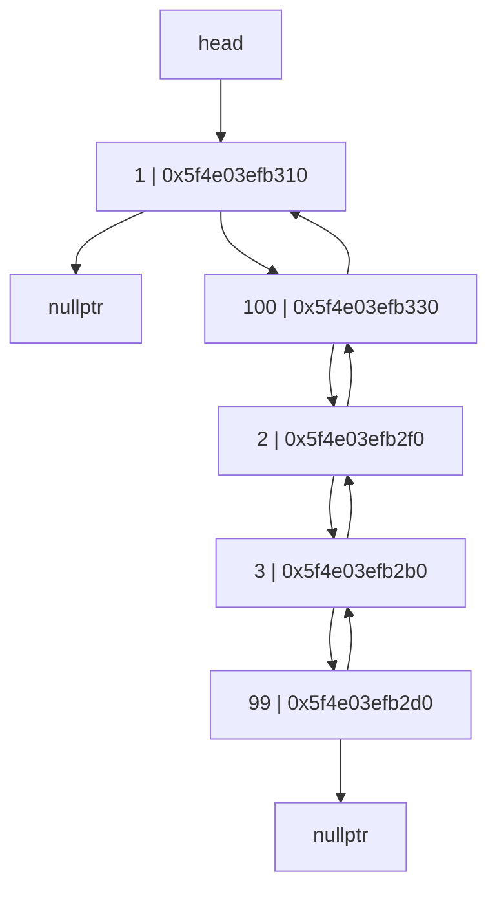

# Doubly Linked List

A doubly linked list is a data structure that consists of a sequence of elements in which each element has a reference to the next and the previous element in the sequence. This allows for efficient insertion and deletion operations at both the beginning and end of the list.

## Advantages of Doubly Linked Lists over Singly Linked Lists

1. Bidirectional traversal
2. Ease of insertion/deletion at both ends

## The node class

```cpp
  struct Node {
    int data;
    Node* next;
    Node* prev;
    Node(int d) : data(d), next(nullptr), prev(nullptr) {}
  };
```

As mentioned earlier, the Node class is the building block of the doubly linked list. Each node object must contain three fields: `data`, `next`, and `prev`. The `data` field will store the value of the element, the `next` field is a pointer to the next node in the list, and the `prev` field is a pointer to the previous node in the list.

This helps to create a chain-like structure where each node is connected to the next and previous nodes. The first node will have a `prev` field with a `null` value, and the last node will have a `next` field with a `null` value.



As you can see, each node points to the next and previous nodes, creating a doubly linked list structure.

## Operations on Doubly Linked List

### Insert at Head

```cpp
int doublyLinkedList::insertAtHead(int id) {
  Nodo* nuevo = new Nodo(id);
  nuevo->next = head;
  if (head != nullptr) {
    head->prev = nuevo;
  }
  head = nuevo;
  return 1;
}

```

This creates a new node with the given data, then moves the node that was the head to the next field of the new node, and finally sets the new node as the head.


The time complexity of this operation is O(1) because it doesn't depend on the number of nodes in the list.

### Delete at Head

```cpp
int doublyLinkedList::deleteHead() {
  if (head == nullptr) {
    cout << "Empty List" << endl;
    return 0;
  }
  Nodo* temp = head;
  head = temp->next;
  if (head != nullptr) {
    head->prev = nullptr;
  }
  delete temp;
  return 1;
}
```

This operation deletes the head node by moving the head to the next node and setting the previous field of the new head to `nullptr`.


The time complexity of this operation is O(1) because it doesn't depend on the number of nodes in the list.

### Insert at End

```cpp
int doublyLinkedList::insertAtEnd(int id) {
  if (head == nullptr) {
    insertAtHead(id);
    return 1;
  }
  Nodo* nuevo = new Nodo(id);
  Nodo* actual = head;
  while (actual->next != nullptr) {
    actual = actual->next;
  }
  actual->next = nuevo;
  nuevo->prev = actual;
  return 1;
}
```

This operation inserts a new node at the end of the list by traversing the list until the last node and then setting the next field of the last node to the new node.


The time complexity of this operation is O(n) in the worst case because it depends on the number of nodes in the list.


