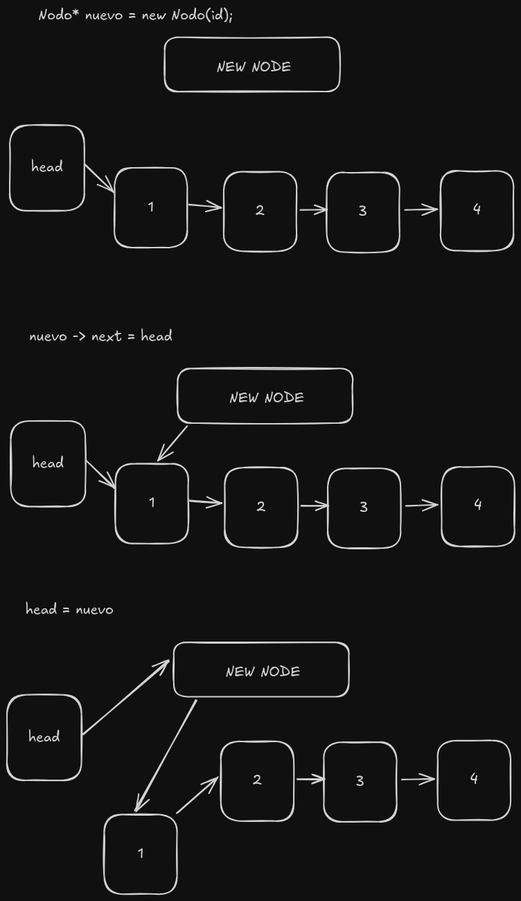
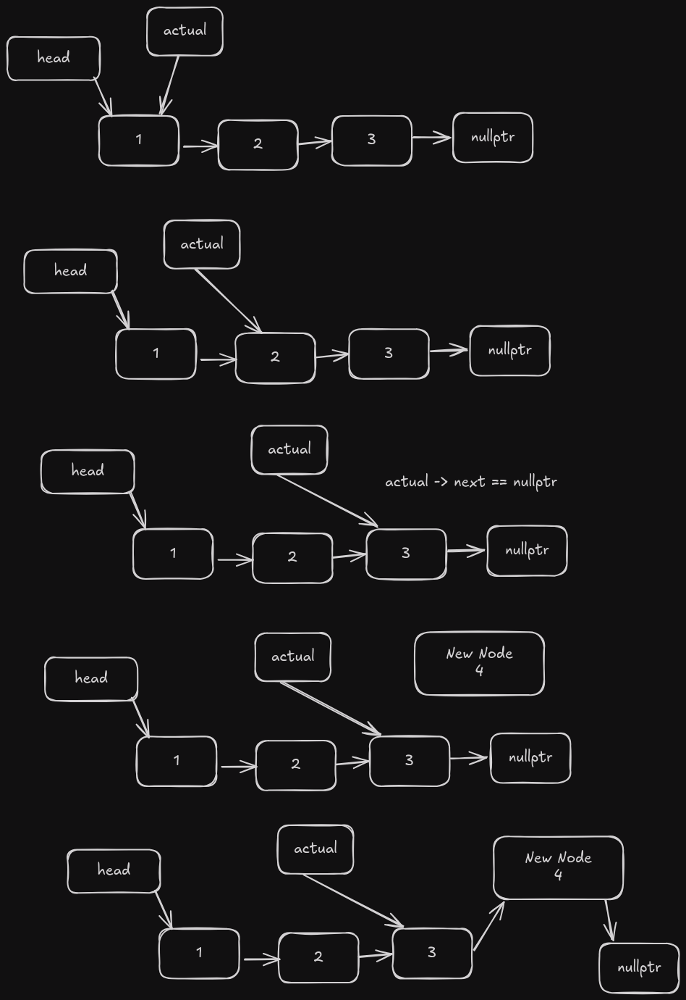
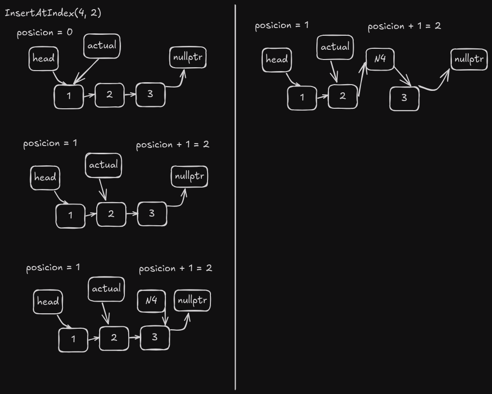

# Lista Enlazada

Una lista enlazada es una estructura de datos lineal donde cada elemento es un objeto separado. Cada elemento (lo llamaremos nodo) de una lista está compuesto por dos elementos: los datos y una referencia al siguiente nodo. El último nodo tiene una referencia a `null`. El punto de entrada a una lista enlazada se llama la cabeza de la lista. Debe tenerse en cuenta que la cabeza no es un nodo separado, sino la referencia al primer nodo. Si la lista está vacía, entonces la cabeza es una referencia `null`.

## Ventajas de las Listas Enlazadas sobre los Arrays

1. Tamaño dinámico
2. Facilidad de inserción/eliminación

## La clase nodo

```cpp
  struct Nodo {
    int data;
    Nodo* next;
    Nodo(int d) : data(d), next(nullptr) {}
  };

Como se mencionó anteriormente, la clase Nodo es el bloque de construcción de la lista enlazada. Cada objeto nodo debe contener dos campos: `data` y `next`. El campo `data` almacenará el valor del elemento, y el campo `next` es un puntero al siguiente nodo en la lista.

Esto ayuda a crear una estructura tipo cadena donde cada nodo está conectado al siguiente nodo. El último nodo tendrá un campo `next` con un valor `null`.


Como puedes ver, el nodo cabeza apunta al primer nodo, y el último nodo apunta a `nullptr`.

## Operaciones en la Lista Enlazada

### Insertar al Principio

```cpp
int linkedList::insertAtHead(int id) {
  Nodo* nuevo = new Nodo(id);
  nuevo->next = head;
  head = nuevo;
  return 1;
}
```

Esto crea un nuevo nodo con los datos proporcionados, luego mueve el nodo que era la cabeza al campo next del nuevo nodo, y finalmente establece el nuevo nodo como la cabeza.



La complejidad temporal de esta operación es O(1) porque no depende del número de nodos en la lista.

### Insertar al Final

```cpp
int linkedList::insertAtEnd(int id) {
  Nodo* actual = head;
  while (actual->next != nullptr) {
    actual = actual->next;
  }
  Nodo* nuevo = new Nodo(id);
  actual->next = nuevo;
  return 1;
}
```

Esta función recorre la lista hasta alcanzar el último nodo, luego crea un nuevo nodo con los datos proporcionados y establece el campo next del último nodo al nuevo nodo.



La complejidad temporal de esta operación es O(n) porque depende del número de nodos en la lista.

### Insertar en Índice

```cpp
int linkedList::insertAtIndex(int id, int index) {
  if (index == 0) {
    insertAtHead(id);
    return 1;
  }

  int posicion = 0;
  Nodo* actual = head;
  while (actual != nullptr && posicion + 1 != index) {
    posicion++;
    actual = actual->next;
  }
  if (actual != nullptr) {
    Nodo* nuevo = new Nodo(id);
    nuevo->next = actual->next;
    actual->next = nuevo;
  } else {
    cout << "Posicion invalida" << endl;
    return 0;
  }
  return 1;
}
```

Esta función recorre la lista hasta alcanzar el nodo anterior al índice, luego crea un nuevo nodo con los datos proporcionados y establece el campo next del nuevo nodo al campo next del nodo en el índice.



La complejidad temporal de esta operación es O(n) porque depende del número de nodos en la lista.

### Eliminar al Principio

```cpp
int linkedList::deleteHead() {
  if (head == nullptr) {
    return 0;
  }
  Nodo* temp = head;
  head = head->next;
  delete temp;
  return 1;
}
```

Esta función elimina el nodo cabeza y establece el siguiente nodo como la nueva cabeza.


La complejidad temporal de esta operación es O(1) porque no depende del número de nodos en la lista.

### Eliminar al Final

```cpp
int linkedList::deleteEnd() {
  if (head == nullptr) {
    return 0;
  }
  Nodo* actual = head;
  while (actual->next != nullptr && actual->next->next != nullptr) {
    actual = actual->next;
  }

  delete actual->next;
  actual->next = nullptr;
  return 1;
}
```

Esta función recorre la lista hasta alcanzar el nodo anterior al último nodo, luego elimina el último nodo.


La complejidad temporal de esta operación es O(n) porque depende del número de nodos en la lista.

### Eliminar en Índice

```cpp
int linkedList::deleteAtIndex(int index) {
  if (index < 0) {
    cout << "No existen indices negativos" << endl;
    return 0;  // Índice inválido
  }
  if (index == 0) {
    deleteHead();
    return 0;
  }
  if (head == nullptr) {
    return 0;
  }
  int contador = 0;
  Nodo* actual = head;
  while (actual != nullptr && contador != index - 1) {
    contador++;
    actual = actual->next;
  }
  if (actual == nullptr || actual->next == nullptr) {
    cout << "No se encontro el indice" << endl;
    return 0;
  }
  Nodo* nodeToDelete = actual->next;
  actual->next = nodeToDelete->next;
  delete nodeToDelete;
  return 1;
}
```

Esta función recorre la lista hasta alcanzar el nodo anterior al índice, luego elimina el nodo en el índice.


La complejidad temporal de esta operación es O(n) porque depende del número de nodos en la lista.

### Obtener Longitud

```cpp
int linkedList::getLength() {
  int contador = 0;
  Nodo* actual = head;
  while (actual != nullptr) {
    actual = actual->next;
    contador++;
  }
  return contador;
}
```

Esta función recorre la lista y cuenta el número de nodos.

La complejidad temporal de esta operación es O(n) porque depende del número de nodos en la lista.

### Buscar Elemento

```cpp
int linkedList::search(int id) {
  int posicion = 0;
  Nodo* actual = head;
  while (actual != nullptr) {
    if (actual->data == id) {
      return posicion;
    }
    posicion++;
    actual = actual->next;
  }
  return -1;
}
```

Esta función recorre la lista y compara los datos de cada nodo con los datos proporcionados.

La complejidad temporal de esta operación es O(n) porque depende del número de nodos en la lista.

### Obtener Elemento en Índice

```cpp
int linkedList::get(int index) {
  Nodo* actual = head;
  int contador = 0;
  while (actual != nullptr) {
    if (contador == index) {
      return actual->data;
    }
    actual = actual->next;
    contador++;
  }
  return -1;
}
```

Esta función recorre la lista hasta alcanzar el nodo en el índice y devuelve los datos de ese nodo.

La complejidad temporal de esta operación es O(n) porque depende del número de nodos en la lista.

### Generar Graphviz

```cpp
void linkedList::generateGraphviz() {
  ofstream archivo;
  archivo.open("./graphviz/linkedList.dot");
  if (archivo.is_open()) {
    archivo << "digraph g {" << endl;
    archivo << "Head [label=\"head\"];" << endl;
    archivo << "Head -> 1" << endl;

    Nodo* actual = head;
    int contador = 1;

    while (actual != nullptr) {
      archivo << contador << "[label=\"" << actual->data << "\\n"
              << actual << "\"]" << endl;
      archivo << contador << "->" << contador + 1 << endl;
      contador++;
      actual = actual->next;
    }
    archivo << contador << "[label=\"nullptr\"]" << endl;
    archivo << "}" << endl;
    archivo.close();
  }
}
```

Esta función genera un archivo Graphviz que representa la lista enlazada.

### Conclusión

Las listas enlazadas son una forma simple y eficiente de almacenar y manipular datos. Son especialmente útiles cuando el tamaño de los datos es desconocido o cuando los datos necesitan ser insertados o eliminados frecuentemente.

No son la mejor opción cuando se requiere acceso aleatorio a los elementos, ya que esta operación tiene una complejidad temporal de O(n).

## Referencias

- [Wikipedia](https://en.wikipedia.org/wiki/Linked_list)

- [GeeksforGeeks](https://www.geeksforgeeks.org/python-linked-list)
