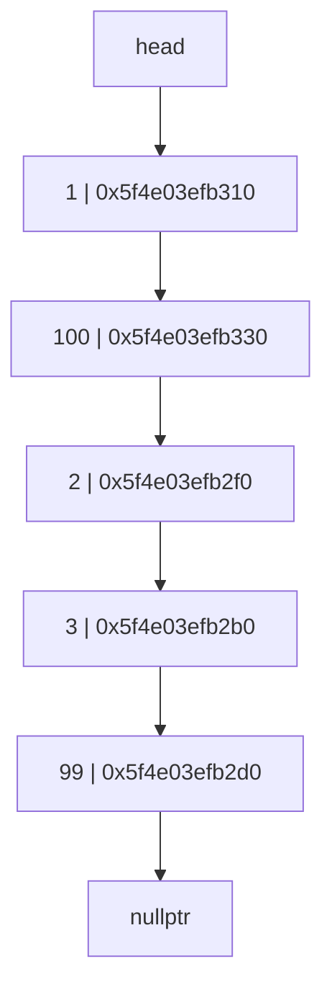
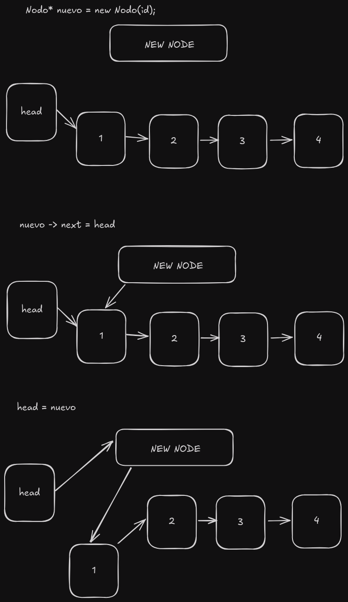
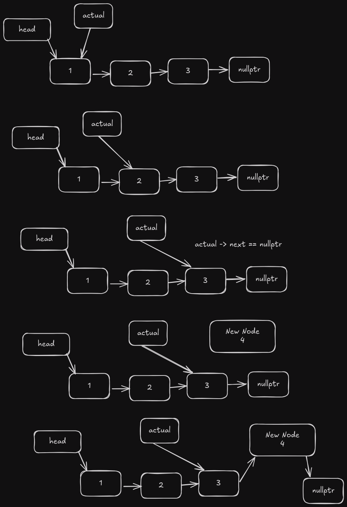
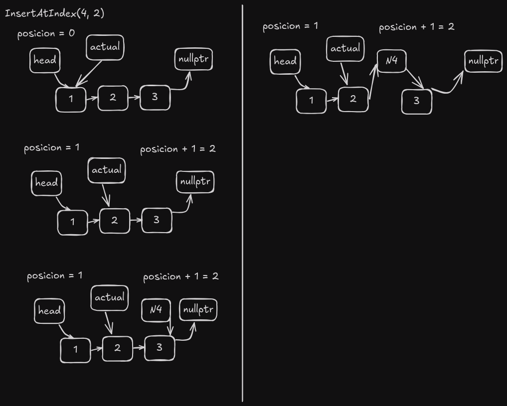
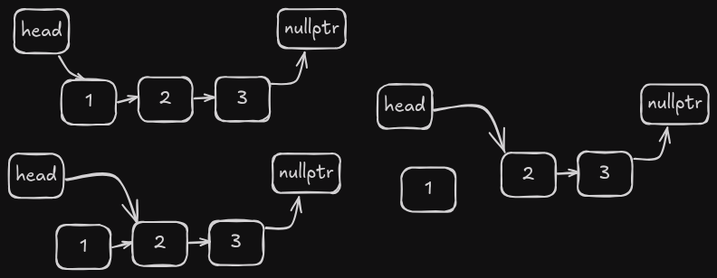
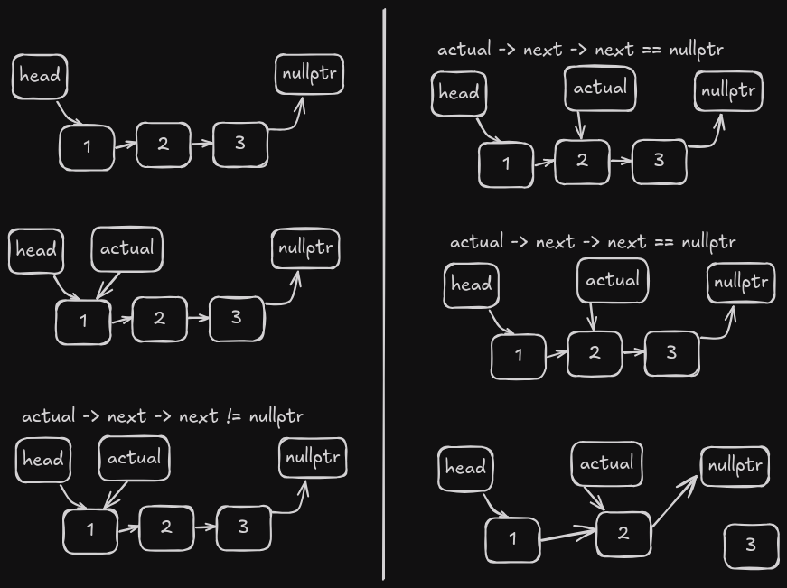

# Linked List

A linked list is a linear data structure where each element is a separate object. Each element (we will call it a node) of a list is comprising of two items - the data and a reference to the next node. The last node has a reference to `null`. The entry point into a linked list is called the head of the list. It should be noted that head is not a separate node, but the reference to the first node. If the list is empty then the head is a `null` reference.

## Advantages of Linked Lists over Arrays

1. Dynamic size
2. Ease of insertion/deletion

## The node class

```cpp
  struct Nodo {
    int data;
    Nodo* next;
    Nodo(int d) : data(d), next(nullptr) {}
  };
```

As mentioned earlier, the Node class is the building block of the linked list. Each node object must contain two fields: `data` and `next`. The `data` field will store the value of the element, and the `next` field is a pointer to the next node in the list.

This helps to create a chain-like structure where each node is connected to the next node. The last node will have a `next` field with a `null` value.



As you can see the head node points to the first node, and the last node points to `nullptr`.

## Operations on Linked List

### Insert at Head

```cpp
int linkedList::insertAtHead(int id) {
  Nodo* nuevo = new Nodo(id);
  nuevo->next = head;
  head = nuevo;
  return 1;
}
```

This creates a new node with the given data, then moves the node that was the head to the next field of the new node, and finally sets the new node as the head.



The time complexity of this operation is O(1) because it doesn't depend on the number of nodes in the list.

### Insert at End

```cpp
int linkedList::insertAtEnd(int id) {
  Nodo* actual = head;
  while (actual->next != nullptr) {
    actual = actual->next;
  }
  Nodo* nuevo = new Nodo(id);
  actual->next = nuevo;
  return 1;
}
```

This function traverses the list until it reaches the last node, then creates a new node with the given data and sets the next field of the last node to the new node.



The time complexity of this operation is O(n) because it depends on the number of nodes in the list.

### Insert at Index

```cpp
int linkedList::insertAtIndex(int id, int index) {
  if (index == 0) {
    insertAtHead(id);
    return 1;
  }

  int posicion = 0;
  Nodo* actual = head;
  while (actual != nullptr && posicion + 1 != index) {
    posicion++;
    actual = actual->next;
  }
  if (actual != nullptr) {
    Nodo* nuevo = new Nodo(id);
    nuevo->next = actual->next;
    actual->next = nuevo;
  } else {
    cout << "Posicion invalida" << endl;
    return 0;
  }
  return 1;
}
```

This function traverses the list until it reaches the node before the index, then creates a new node with the given data and sets the next field of the new node to the next field of the node at the index.



The time complexity of this operation is O(n) because it depends on the number of nodes in the list.

### Delete at Head

```cpp
int linkedList::deleteHead() {
  if (head == nullptr) {
    return 0;
  }
  Nodo* temp = head;
  head = head->next;
  delete temp;
  return 1;
}
```

This function deletes the head node and sets the next node as the new head.



The time complexity of this operation is O(1) because it doesn't depend on the number of nodes in the list.

### Delete at End

```cpp
int linkedList::deleteEnd() {
  if (head == nullptr) {
    return 0;
  }
  Nodo* actual = head;
  while (actual->next != nullptr && actual->next->next != nullptr) {
    actual = actual->next;
  }

  delete actual->next;
  actual->next = nullptr;
  return 1;
}
```

This function traverses the list until it reaches the node before the last node, then deletes the last node.



The time complexity of this operation is O(n) because it depends on the number of nodes in the list.

### Delete at Index

```cpp
int linkedList::deleteAtIndex(int index) {
  if (index < 0) {
    cout << "No existen indices negativos" << endl;
    return 0;  // Índice inválido
  }
  if (index == 0) {
    deleteHead();
    return 0;
  }
  if (head == nullptr) {
    return 0;
  }
  int contador = 0;
  Nodo* actual = head;
  while (actual != nullptr && contador != index - 1) {
    contador++;
    actual = actual->next;
  }
  if (actual == nullptr || actual->next == nullptr) {
    cout << "No se encontro el indice" << endl;
    return 0;
  }
  Nodo* nodeToDelete = actual->next;
  actual->next = nodeToDelete->next;
  delete nodeToDelete;
  return 1;
}
```

This function traverses the list until it reaches the node before the index, then deletes the node at the index.


The time complexity of this operation is O(n) because it depends on the number of nodes in the list.

### Get Length

```cpp
int linkedList::getLength() {
  int contador = 0;
  Nodo* actual = head;
  while (actual != nullptr) {
    actual = actual->next;
    contador++;
  }
  return contador;
}
```

This function traverses the list and counts the number of nodes.

The time complexity of this operation is O(n) because it depends on the number of nodes in the list.

### Search Element

```cpp
int linkedList::search(int id) {
  int posicion = 0;
  Nodo* actual = head;
  while (actual != nullptr) {
    if (actual->data == id) {
      return posicion;
    }
    posicion++;
    actual = actual->next;
  }
  return -1;
}
```

This function traverses the list and compares the data of each node with the given data.

The time complexity of this operation is O(n) because it depends on the number of nodes in the list.

### Get Element at Index

```cpp
int linkedList::get(int index) {
  Nodo* actual = head;
  int contador = 0;
  while (actual != nullptr) {
    if (contador == index) {
      return actual->data;
    }
    actual = actual->next;
    contador++;
  }
  return -1;
}
```

This function traverses the list until it reaches the node at the index and returns the data of that node.

The time complexity of this operation is O(n) because it depends on the number of nodes in the list.

### Generate Graph

```cpp
void linkedList::generateGraphviz() {
  ofstream archivo;
  archivo.open("./graphviz/linkedList.dot");
  if (archivo.is_open()) {
    archivo << "digraph g {" << endl;
    archivo << "Head [label=\"head\"];" << endl;
    archivo << "Head -> 1" << endl;

    Nodo* actual = head;
    int contador = 1;

    while (actual != nullptr) {
      archivo << contador << "[label=\"" << actual->data << "\\n"
              << actual << "\"]" << endl;
      archivo << contador << "->" << contador + 1 << endl;
      contador++;
      actual = actual->next;
    }
    archivo << contador << "[label=\"nullptr\"]" << endl;
    archivo << "}" << endl;
    archivo.close();
  }
}
```

This function generates a Graphviz file that represents the linked list.

### Conclusion

Linked lists are a simple and efficient way to store and manipulate data. They are especially useful when the size of the data is unknown or when the data needs to be frequently inserted or deleted.

They are not the best choice when random access to elements is required, as this operation has a time complexity of O(n).

## References

- [Wikipedia](https://en.wikipedia.org/wiki/Linked_list)

- [GeeksforGeeks](https://www.geeksforgeeks.org/python-linked-list)
