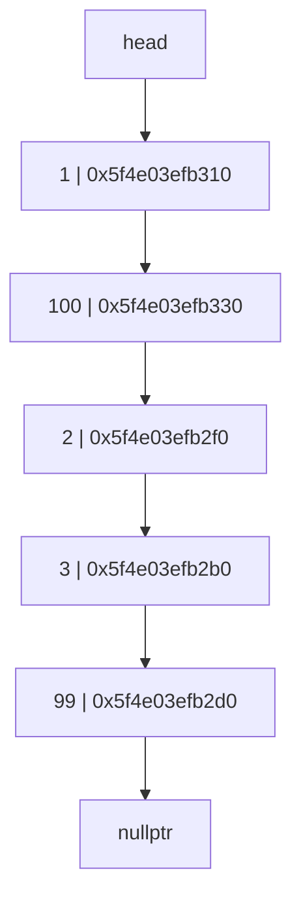

# Linked List

A linked list is a linear data structure where each element is a separate object. Each element (we will call it a node) of a list is comprising of two items - the data and a reference to the next node. The last node has a reference to `null`. The entry point into a linked list is called the head of the list. It should be noted that head is not a separate node, but the reference to the first node. If the list is empty then the head is a `null` reference.

## Advantages of Linked Lists over Arrays

1. Dynamic size
2. Ease of insertion/deletion

## The node class

```cpp
  struct Nodo {
    int data;
    Nodo* next;
    Nodo(int d) : data(d), next(nullptr) {}
  };
```

As mentioned earlier, the Node class is the building block of the linked list. Each node object must contain two fields: `data` and `next`. The `data` field will store the value of the element, and the `next` field is a pointer to the next node in the list.

This helps to create a chain-like structure where each node is connected to the next node. The last node will have a `next` field with a `null` value.



As you can see the head node points to the first node, and the last node points to `nullptr`.

## Operations on Linked List

### Insert at Head

```cpp
int linkedList::insertAtHead(int id) {
  Nodo* nuevo = new Nodo(id);
  nuevo->next = head;
  head = nuevo;
  return 1;
}
```

This creates a new node with the given data, then moves the node that was the head to the next field of the new node, and finally sets the new node as the head.


### Insert at End

```cpp
int linkedList::insertAtEnd(int id) {
  Nodo* actual = head;
  while (actual->next != nullptr) {
    actual = actual->next;
  }
  Nodo* nuevo = new Nodo(id);
  actual->next = nuevo;
  return 1;
}
```

This function traverses the list until it reaches the last node, then creates a new node with the given data and sets the next field of the last node to the new node.