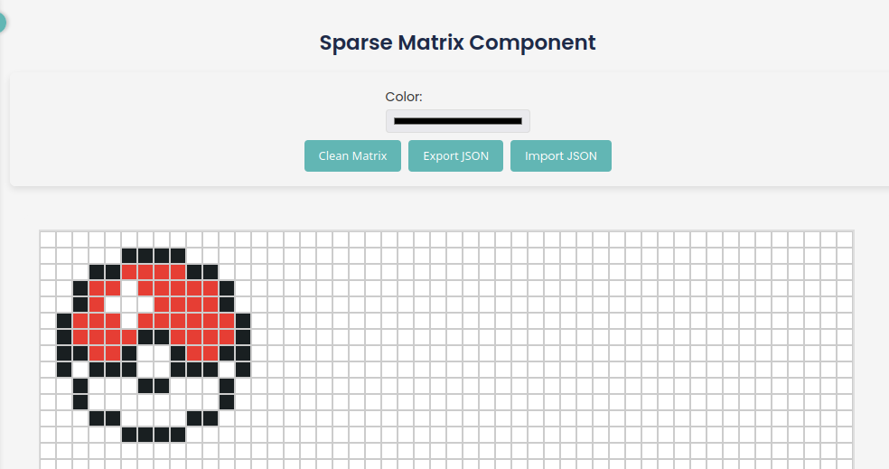

# Matriz Dispersa (Sparse Matrix)

Una matriz dispersa es una matriz en la que la mayoría de los elementos son cero. En contraste, si la mayoría de los elementos son diferentes de cero, entonces la matriz se considera densa. No existe una definición estricta de qué tan dispersa debe ser una matriz para considerarse dispersa, pero un criterio común es que el número de elementos diferentes de cero sea aproximadamente igual al número de filas o columnas, o menos.

Las matrices dispersas se utilizan en análisis numérico, minería de datos y otros campos donde se manejan grandes conjuntos de datos. En estas situaciones, la memoria puede ser un problema, y un caso de uso típico es almacenar solo los elementos diferentes de cero.

Hay varias formas de almacenar matrices dispersas en memoria. La más común es el formato de lista de coordenadas (COO), que almacena los índices de fila y columna de cada elemento diferente de cero. Otro formato común es el formato de fila dispersa comprimida (CSR), que almacena los índices de fila, índices de columna y valores de los elementos diferentes de cero.

En este repositorio, proporcionamos una implementación simple de una matriz dispersa en C++. La matriz se almacena en formato CSR, y proporcionamos funciones para leer y escribir la matriz desde un archivo json.

## Uso

He implementado una matriz de una manera principalmente visual, utilicé una cuadrícula en el frontend para representar la matriz, básicamente el usuario puede agregar colores en una posición y eso se almacena en la matriz.
Esta matriz luego puede crear un archivo json que la representa.

### Operaciones

- Agregar un color a una posición
- Eliminar un color de una posición
- Guardar la matriz en un archivo json
- Cargar la matriz desde un archivo json

### Agregar un color a una posición

Para agregar un color a una posición, puedes hacer clic en la cuadrícula y seleccionar un color del selector de colores. Luego haz clic en la posición donde deseas agregar el color.

Esto llama a esta función:

```cpp
int sparseMatrix::insertColor(string color, int colIndex, int rowIndex) {
  if (rowIndex < 0 || colIndex < 0)
    return 0;

  HeaderNode* headerX = insertHeader(rowIndex, true);
  HeaderNode* headerY = insertHeader(colIndex, false);

  Nodo* nuevo = new Nodo(color, rowIndex, colIndex);

  if (headerX->dato == nullptr || headerX->dato->columna > colIndex) {
    nuevo->derecha = headerX->dato;
    headerX->dato = nuevo;
  } else {
    Nodo* temp = headerX->dato;
    headerX->dato = nuevo;
    while (temp->derecha != nullptr && temp->derecha->columna < colIndex) {
      temp = temp->derecha;
    }
    if (temp->derecha != nullptr && temp->derecha->columna == colIndex) {
      temp->derecha->color = color;
      delete nuevo;
      return 1;
    }
    nuevo->derecha = temp->derecha;
    temp->derecha = nuevo;
    if (nuevo->derecha != nullptr) {
      nuevo->derecha->izquierda = nuevo;
    }
    nuevo->izquierda = temp;
  }

  if (headerY->dato == nullptr || headerY->dato->fila > rowIndex) {
    nuevo->abajo = headerY->dato;
    headerY->dato = nuevo;
  } else {
    Nodo* temp = headerY->dato;
    headerY->dato = nuevo;
    while (temp->abajo != nullptr && temp->abajo->fila < rowIndex) {
      temp = temp->abajo;
    }
    if (temp->abajo != nullptr && temp->abajo->fila == rowIndex) {
      temp->abajo->color = color;
      delete nuevo;
      return 1;
    }
    nuevo->abajo = temp->abajo;
    temp->abajo = nuevo;
    if (nuevo->abajo != nullptr) {
      nuevo->abajo->arriba = nuevo;
    }
    nuevo->arriba = temp;
  }

  cout << "Color: " << color << " en la posicion: " << colIndex << ", "
       << rowIndex << endl;

  jsonFile["matrix"].push_back(
      {{"color", color}, {"column", colIndex}, {"row", rowIndex}});

  return 1;
}
```

Como puedes ver, esta función inserta un nuevo nodo en la matriz y luego agrega el color al archivo json.

Explicación paso a paso:

1. Verificar si la posición es válida
2. Insertar el encabezado si no existe
3. Insertar el nodo en la fila
4. Insertar el nodo en la columna
5. Agregar el color al archivo json

### Leer la matriz desde un archivo json

Para leer la matriz desde un archivo json, puedes hacer clic en el botón "Importar" y seleccionar el archivo json que deseas importar.

Esto llama a esta función:

```cpp
void sparseMatrix::insertJson(json text) {
  if (text.is_array()) {
    for (const auto& element : text) {
      string color = element["color"];
      int column = element["column"];
      int row = element["row"];

      // Insertar cada elemento en la matriz
      insertColor(color, column, row);
    }
  } else {
    cout << "Error: Los datos enviados no son un array" << endl;
  }
}
```

Como puedes ver, esta función lee el archivo json e inserta cada elemento en la matriz.

Explicación paso a paso:

1. Verificar si el archivo json es un array
2. Iterar sobre cada elemento en el array
3. Obtener el color, columna y fila del elemento
4. Insertar el elemento en la matriz

## ¿Cómo se representa esto en el frontend?

La matriz se representa como una cuadrícula, donde cada celda puede tener un color. El usuario puede hacer clic en una celda para agregar un color, y hacer clic nuevamente para eliminar el color. Es básicamente como un programa de pintura, pero en lugar de pintar, estás agregando colores a una matriz.

Creo que esta es una forma divertida y buena de representar una matriz, y también es una buena manera de aprender a trabajar con matrices.



Esta es la matriz creada en el frontend, como puedes ver, el usuario puede agregar colores a la matriz y luego guardarla en un archivo json.

El archivo json para esta imagen es este:

- [JSON de Pokeball](../pokeball.json)

Que como puedes ver tiene esta estructura:

```json
{
    "matrix": [
        {
            "color": "#191f21",
            "column": 5,
            "row": 1
        },
        {
            "color": "#191f21",
            "column": 6,
            "row": 1
        },
        {
            "color": "#191f21",
            "column": 7,
            "row": 1
        }
        // ... más elementos
    ]
}
```
